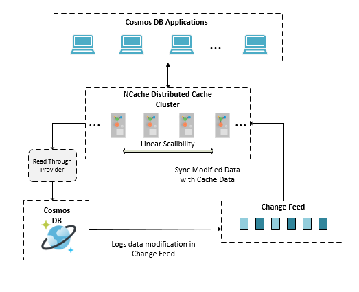

# Sync Azure Cosmos DB with NCache using NotifyExtensibleDependency

## Table of contents

* [Introduction](#introduction)
* [NotifyExtensibleDependency Overview](#notifyextensibledependency-overview)
* [Prerequisites](#pre-requisites)
* [NCache Features Highlighted in Application](#ncache-features-highlighted-in-application)
* [Running the Application](#running-the-application)
* [Additional Resources](#additional-resources)
* [Technical Support](#technical-support)
* [Copyrights](#copyrights)

## Introduction

This project highlights the NCache **NotifyExtensibleDependency** feature and how it can be used to synchronize NCache with Cosmos DB SQL API collections. The following are the advantages of NCache together with this feature when used with Azure Cosmos DB:

- **Faster Read Operations**

  Using NCache as your distributed caching solution, application performance is improved since it is an in-memory key-value store which   greatly improves data read performance. Furthermore, with more data operations being serviced by the cache instead of the underlying     Cosmos DB database, the transaction costs incurred in terms of RU/s are greatly reduced as well. More information about using caching   with Cosmos DB can be found [here](https://www.alachisoft.com/blogs/how-to-use-caching-with-azure-cosmos-db/). 
  
- **Stale Data Problem Mitigation**

  Although using NCache with Cosmos DB boosts application performance, thee is one issue that needs to be kept in mind. When you start     caching with a primary data store such as Cosmos DB, two copies of the same data will be created, one in the primary data store and     the other in the cache. Any direct update to the database data could render the cache data stale. With **NotifyExtensibleDependency**,   not only are we taking advantage of the increased read performance provided by NCache, but we can also make sure that stale data does   not persist in the cache.
  
- **Improved Scalability**

  Using **NotifyExtensibleDependency**, all the cache synchronization operations are handed over to the clustered cache itself, allowing   the clients to focus on the core business logic. Not only does this create a clean logical separation of concerns among the NCache       client and servers but it also provides improved scalability of the overall system architecture since any increase in change feed       load can easily be handled by scaling out the NCache cluster instead of having to perform scale-up on the client-side hardware, an       important implication for today's cloud-based microservices applications.
 
## NotifyExtensibleDependency Overview

   [**NotifyExtensibleDependency**](https://www.alachisoft.com/resources/docs/ncache/prog-guide/notification-extensible-dependency.html) is a cache synchronization strategy for tackling the stale data problem whose primary purpose is to the solution architect the flexibility to integrate **real-time** custom datastore state-change monitoring and processing logic directly into the cache hosting processes running on the cache servers, removing the need for pre-planning the CPU and memory utilization resources needed by the client applications to keep the cache in-sync with the primary datastore and allowing for a sharper focus on the core business needs. 
   In this scheme, the developer deploys a provider that holds the datastore state-change monitoring and processing logic behind the depedency along with the lifecycle hooks into the NCache servers. The servers then invoke the dependency-related methods which encapsulate the custom logic and determine whether or not to remove the cached item.
   
More information regarding **NotifyExtensibleDependency** can be found [here](https://www.alachisoft.com/resources/docs/ncache/prog-guide/notification-extensible-dependency.html). With cache synchronization logic deployed to the cache servers using **NotifyExtensibleDependency**, the overall architecture including NCache and the [Cosmos DB Change Feed][https://docs.microsoft.com/en-us/azure/cosmos-db/change-feed] can visualized as in the figure given below. This diagram also highlights the use of a [read-through provider](https://www.alachisoft.com/resources/docs/ncache/prog-guide/read-through-caching.html) to allow for **auto-reloading** updated data into the cache:


  

## Pre-requisites

  Before running the application, make sure the following requirements have been met:

  - Windows 10 64-bit development machines with [.NET Framework 4.7.2 runtime](https://dotnet.microsoft.com/download/dotnet-framework/net472) for hosting the NCache servers.
  - The latest [Cosmos DB Emulator](https://docs.microsoft.com/en-us/azure/cosmos-db/local-emulator) configured for [remote network access](https://docs.microsoft.com/en-us/azure/cosmos-db/local-emulator#running-on-a-local-network).
  - Make sure to export the SSL certificate of the Cosmos DB emulator on each of the NCache server nodes to allow for change feed processing to work on the server side implemented logic.
  - An IDE to run the code such as [Visual Studio 2019](https://visualstudio.microsoft.com/).
  - The .NET Framework 4.7.2 SDK and Runtime environments have been installed to compile and package the application. Those can be installed from [here](https://dotnet.microsoft.com/download/dotnet-framework/net472).
  - **NCache 5.0 SP2 Enterprise edition** is installed on the cache server machines. The installation files can be found [here](https://www.alachisoft.com/download-ncache.html).
## Implementation
 We can finally get to writing our code. The following is our implementation of the NotifyExtensibleDependency class:
 CosmoDbNotificationDependency.cs
```csharp
[Serializable]
public class CosmosDbNotificationDependency :
        NotifyExtensibleDependency, IEquatable<CosmosDbNotificationDependency>
{
  // The key of the item in the database against which we are setting dependency
  private readonly string _cacheKey;
  // Unique id for the dependency instance
  private readonly string _dependencyId;
  // The change feed processor key against which we will be saving an instance of 
  // IChangeFeedProcessor
  private readonly string _changeFeedProcessorKey;
	
  // Lock to synchronize registration and removal of dependency instance from 
  // dependency tracking data structures
  private static readonly object lock_mutex = new object();

  public CosmosDbNotificationDependency(
        string cacheKey,
        string cacheId,
        string monitoredUriString,
        string monitoredAuthKey,
        string monitoredDatabaseId,
        string monitoredContainerId,
        string leaseUriString,
        string leaseAuthKey,
        string leaseDatabaseId,
        string leaseContainerId)
  {
       // Validate arguments 

      _dependencyId = $"cosmosDependency-{Guid.NewGuid().ToString()}";
      _cacheKey = cacheKey;
      _changeFeedProcessorKey = $"{monitoredUriString}-{monitoredAuthKey}- 
                                     {monitoredDatabaseId}-{monitoredContainerId}-
                                     {leaseUriString}-{leaseAuthKey}-
                                     {leaseDatabaseId}-{leaseContainerId}-
                                     {cacheId}";
  }
  // Overall unique identifier used to track dependency against change feed 
  // processor instances on which the dependency is reliant
  public string DependencyId
  {
      get
      {
          return _dependencyId + _changeFeedProcessorKey + _cacheKey;
      }
  }
  public override bool Initialize()
  {
    var dependencyKey = $"{_changeFeedProcessorKey} {_cacheKey}";
    RegisterDependency(_changeFeedProcessorKey, dependencyKey, this);

    return true;
  }
  protected override void DependencyDispose()
  {
    var dependencyKey = $"{_changeFeedProcessorKey} {_cacheKey}";
    UnregisterDependency(_changeFeedProcessorKey, dependencyKey, this);
  }
  
  private static void RegisterDependency(string changeFeedProcessorKey,string dependencyKey,
        CosmosDbNotificationDependency dependency)
  {
     // 1- dependencyOnKeys
     //    dependencyOnKeys is a static dictionary that maps information on a 
          //    collection key to the set of dependencies that rely on it as a single  
          //    database document can have multiple dependent cached items
          // 2- dependencyOnProcessors
          //    dependencyOnProcessors is a static dictionary that maps information on      
          //    a change feed processor instance to the set of dependencies IDs. 
          //    Everytime a dependency is invoked, the dependency count associated with 
          //    the change feed processor is decremented. Once the number of 
          //    dependencies for a given change feed processors is 0, we can stop the 
          //    change feed processor. Used in conjuction with the changeFeedProcessors 
          //    dictionary explained next. 
     // 3- changefeedProcessors
          //    changefeedProcessors is a static dictionary that maps a key to a 
          //    IChangeFeedProcessorInstance and the same key is used in the 
          //    dependencyOnProcessors mapping. Once the number of dependency Ids 
          //    associated with a key reaches 0, the same key can be used to access the 
          //    IChangeFeedProcessor instance in the changefeedProcessors mapping and 
          //    stop it.

      lock (lock_mutex)
      {

          if (!dependenciesOnKeys.ContainsKey(dependencyKey))
          {
              dependenciesOnKeys.Add(dependencyKey, new HashSet<CosmosDbNotificationDependency>(comparer));

              if (!dependenciesOnProcessors.ContainsKey(changeFeedProcessorKey))
              {
                  dependenciesOnProcessors.Add(changeFeedProcessorKey, new HashSet<string>(StringComparer.Ordinal));
                  changefeedProcessors.Add(changeFeedProcessorKey, CreateChangeFeedProcessor(changeFeedProcessorKey));
                  changefeedProcessors[changeFeedProcessorKey].StartAsync().Wait();
              }
          }

          dependenciesOnKeys[dependencyKey].Add(dependency);          
          dependenciesOnProcessors[changeFeedProcessorKey].Add(dependency.DependencyId);
      }
  }
  private static void UnregisterDependency(string changeFeedProcessorKey,string dependencyKey,
  CosmosDbNotificationDependency dependency)
  {

      lock (lock_mutex)
      {
          dependenciesOnKeys[dependencyKey].Remove(dependency);
          dependenciesOnProcessors[changeFeedProcessorKey].Remove(dependency.DependencyId);

          if (dependenciesOnKeys[dependencyKey].Count == 0)
          {
              dependenciesOnKeys.Remove(dependencyKey);

              if (dependenciesOnProcessors[changeFeedProcessorKey].Count == 0)
              {
                  dependenciesOnProcessors.Remove(changeFeedProcessorKey);
                  changefeedProcessors[changeFeedProcessorKey].StopAsync().Wait();
                  changefeedProcessors.Remove(changeFeedProcessorKey);
              }
          } 
       }
   }
  private static IChangeFeedProcessor CreateChangeFeedProcessor(string changeFeedProcessorKey)
  {
     // Split the changeFeedProcessorKey method argument and get the parameters to 
    // initialize the IChangeFeedProcessor instance

      return new ChangeFeedProcessorBuilder()
            .WithHostName(hostName)
            .WithFeedCollection(monitoredContainerInfo)
            .WithLeaseCollection(leaseContainerInfo)
            .WithFeedDocumentClient(feedClient)
            .WithLeaseDocumentClient(leaseClient)
            .WithObserverFactory(new CosmosDbChangFeedObserverFactory(changeFeedProcessorKey))
            .WithProcessorOptions(new ChangeFeedProcessorOptions
            {
                     // We create a separate lease document for each of the cache
                     // server nodes so as to avoid missing on updates to db state 
                    // changes
                    LeasePrefix = $"NCache--{cacheId}-{Guid.NewGuid().ToString()}",
                    StartTime = DateTime.Now
            })
            .BuildAsync()
            .GetAwaiter()
            .GetResult();
  }
}
```
The following shows the implementation of the CosmosDbChangeFeedObserverFactory class used to create the change feed observers by the change feed processors:
```csharp
[Serializable]
internal class CosmosDbChangFeedObserverFactory : IChangeFeedObserverFactory
{
        private readonly string _changeFeedProcessorKey;

        public CosmosDbChangFeedObserverFactory( string changeFeedProcessorKey)
        {
            _changeFeedProcessorKey = changeFeedProcessorKey;
        }
        public IChangeFeedObserver CreateObserver()
        {
            return new NCacheChangeFeedObserver(_changeFeedProcessorKey);
        }
}
```
The following shows the implementation of the IChangeFeedObserver class whose instances will process the change feed results for our custom CosmosDbNotificationDependency instances:
NCacheChangeFeedObserver.cs
```csharp
[Serializable]
internal class NCacheChangeFeedObserver : IChangeFeedObserver
{
 private readonly string _changeFeedProcessorKey;
 public NCacheChangeFeedObserver(string changeFeedProcessorKey)
 {
   _changeFeedProcessorKey = changeFeedProcessorKey;
 }

 public Task CloseAsync(IChangeFeedObserverContext context,ChangeFeedObserverCloseReason reason)
  {
    return Task.CompletedTask;
  }

  public Task OpenAsync(IChangeFeedObserverContext context)
  {
    return Task.CompletedTask;
  }

  public Task ProcessChangesAsync(IChangeFeedObserverContext context,IReadOnlyList<Document> docs,
  CancellationToken cancellationToken)
  {
    var changedKeys = (from doc in docs select doc.Id).ToList();
    for (int i = 0; i < changedKeys.Count; i++)
    {
      changedKeys[i] = $"{_changeFeedProcessorKey} {changedKeys[i]}";
    }
    var markedDependencyKeys = new List<string>();
    HashSet<CosmosDbNotificationDependency> markedDependencies;
    foreach (var key in changedKeys)
    {
      if (CosmosDbNotificationDependency.dependenciesOnKeys.ContainsKey(key))
      {
          markedDependencies = new HashSet<CosmosDbNotificationDependency>(
                      CosmosDbNotificationDependency.dependenciesOnKeys[key]);
          foreach (var dep in markedDependencies)
          {
             dep.DependencyChanged.Invoke(this);
          }   
      }
    }

    return Task.CompletedTask;
  }
}
```
Once the project is built and assemblies created, deploy the assemblies to a cache using the method shown in the previous section. After this is done, you can start the cache.
Once the cache is started, we can test that the dependency is working. Below is a code snippet showing how an instance of the NotifyExtensibleDependency implementation we have created and deployed can be used at the client side:
```csharp
CacheItem item = new CacheItem(customer);
item.Dependency = new CosmosDbNotificationDependency("ALFKI",
                    		"myCache",
                    		"<AccountEndpoint>",
                    		"<AccountKey>",
                    		"demoDatabase",
                    		"Customers",
                    		"<AccountEndpoint>",
                    		"<AccountKey>",
                    		"demoDatabase",
                    		"leases");

_cache.Insert("Customer:CustomerID:ALFKI", item);
```
Now that the item is in the cache along with the dependency metadata encapsulating the parameters of the database state it is concerned with, any update on the item with the specified key on the database side will be observed by a change feed processor instance running on the servers and the dependency will be invoked, triggering the removal of the stale cache data. 

## NCache Features Highlighted in Application

Here are the main features of the application demonstrating **NotifyExtensibleDependency**:

  - **Server-Side Cache Synchronization Logic**
  
    As mentioned in the [introduction](#introduction), **NotifyExtensibleDependency** allows for custom logic to be deployed server-side. For this application that demontrates its use with Cosmos DB SQL API Change Feed, our implementation utilizes the [**Change Feed Processor library v2**](https://github.com/Azure/azure-documentdb-changefeedprocessor-dotnet). Details of the NotifyExtensibleDependency implementation can be found [here](./src/CustomDependencyNotifyImpl/CosmosDbNotificationDependency.cs).
    
  - **NCache Reliability**
  
    NCache has the capability of withstanding node failures during operations and prevents delays in application downtime. This is demonstrated in the [console application](./src/NotifyExtensibleDependencyTesterUI/Tester.cs) where we can use the **Test2** function to show that if a node goes down in a clustered cache with multiple nodes, the items together with the dependency states remain intact.
    
    
## Running the Application

  Here are the steps for running the application:
  
  - Make sure to update the NCache server information in the [**client.ncconf**](https://www.alachisoft.com/resources/docs/ncache/admin-guide/client-config.html) files included in the [console application project](./src/NotifyExtensibleDependencyTesterUI). This server information includes the cache ID of the cache to be created and the IP address of atleast one of the servers that will be used.
  - Build and package the application and make sure the assemblies have been successfully generated.
  - Using the [NCache Web Manager GUI](https://www.alachisoft.com/resources/docs/ncache/admin-guide/ncache-web-manager.html?tabs=windows%2Cwindows-start-manager), create a [**partitioned-of-replica**(POR)](https://www.alachisoft.com/ncache/caching-topology.html#partitionedreplica) clustered cache with two nodes using the steps given [here](https://www.alachisoft.com/resources/docs/ncache/admin-guide/create-new-cache-cluster.html?tabs=windows#using-ncache-web-manager). Make sure the cache ID and IP address of the nodes agree with the values given in the [**client.ncconf**](./src/NotifyExtensibleDependencyTesterUI/client.ncconf) and cache ID given in [**app.config**](./src/NotifyExtensibleDependencyTesterUI/App.config) is the same as the entry in the **client.ncconf** file. **Note:Although you can use any cache topology with the application without changing the source code, the POR topology adds reliability with data-paritioning and best demonstrates the capabilities of NCache when a balance between reliability and performance is required.** 
  - Stop the demo cache if it is running and deploy the built [NotifyExtensibleDependency](./src/CustomDependencyNotifyImpl) project assemblies on the cache servers. The steps for doing this are shown [here](https://www.alachisoft.com/resources/docs/ncache/admin-guide/deploy-providers.html). Once the logic is deployed, re-start the cache to get the integration assemblies included in the cache host process.
  - Update the connection URI and auth key values for the Cosmos DB emulator in the [**app.config**](./src/NotifyExtensibleDependencyTesterUI/App.config) file and confirm that those are the URI and auth key acquired when configuring local network access as detailed in the [pre-requisites](#pre-requisites) section. 
  - Before starting the application, confirm again that the cache and the Cosmos DB emulator are running and that the machines hosting the NCache servers can access the Cosmos DB emulator.
  - [Open the statistics window of the running cache](https://www.alachisoft.com/resources/docs/ncache/admin-guide/browse-cache-statistics.html?tabs=windows#ncache-web-manager) to view data as it is added to the cache in real time. Start the application and watch as the items are first added and then removed when the documents are updated in the database due to the dependencies on the cached items being invoked.  
  

## Additional Resources

### Documentation
The complete online documentation for NCache is available at:
[http://www.alachisoft.com/resources/docs/](http://www.alachisoft.com/resources/docs/)

### Programmers' Guide
The complete programmers guide of NCache is available at:
[http://www.alachisoft.com/resources/docs/ncache/prog-guide/](http://www.alachisoft.com/resources/docs/ncache/prog-guide/)

## Technical Support

Alachisoft [C] provides various sources of technical support. 

- Please refer to [Alachisoft Support](http://www.alachisoft.com/support.html) to select a support resource you find suitable for your issue.
- To request additional features in the future, or if you notice any discrepancy regarding this document, please drop an email to [support@alachisoft.com](mailto:support@alachisoft.com).

### Copyrights

[C] Copyright 2020 Alachisoft 
