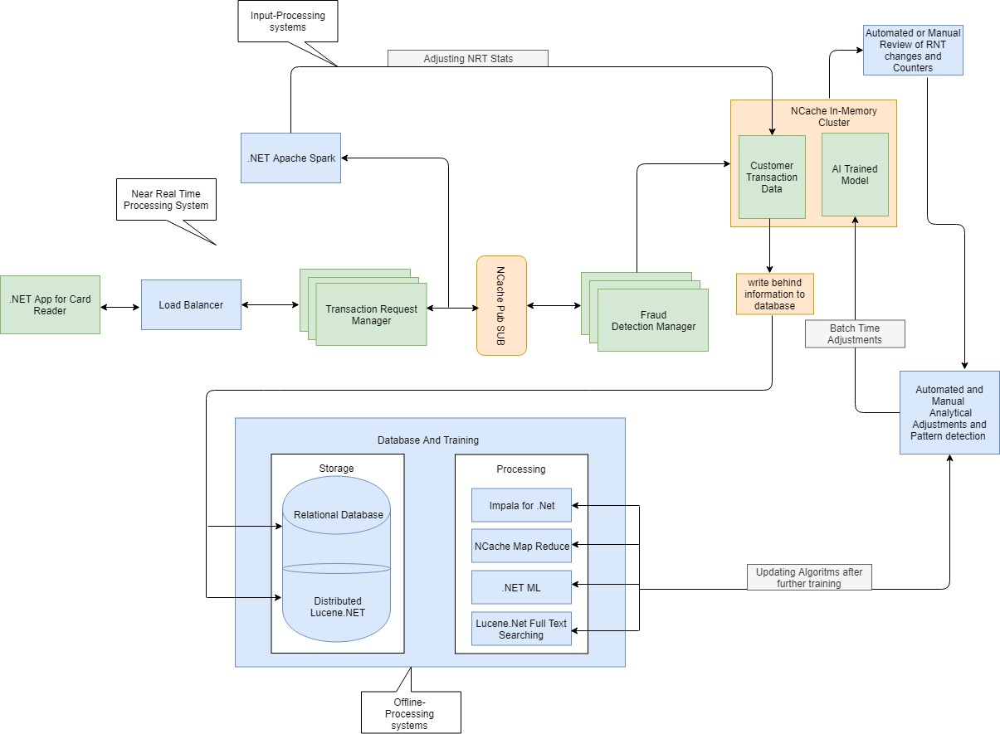
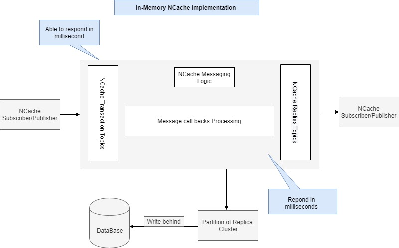
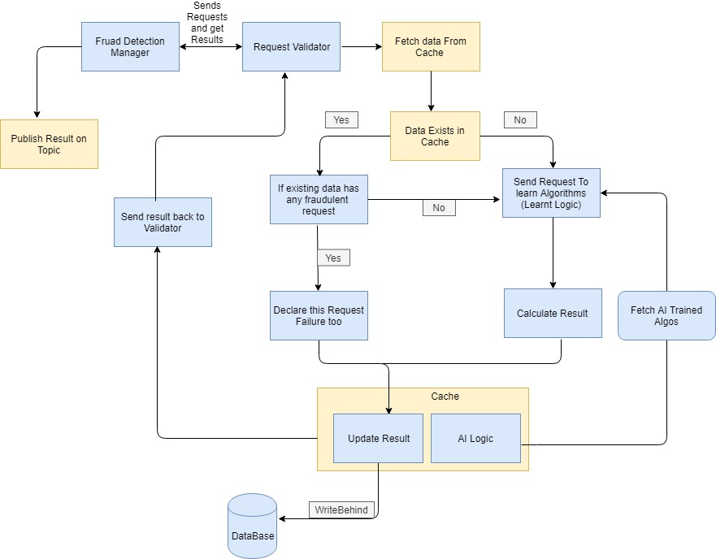

# Distributed Fraud Detection System in .NET with Machine Learning and NCache 

Designing a fraud detection system is like studying the human behavior and predicting the outcomes of their next action. These systems identify if people are behaving in the way ‘’they should” and detect if any anomaly occurs and thus, fail the transaction. It’s just like how your brain behaves while making a decision. For example,a hockey player will make decision in an instant, about where he has to strike the goal. He doesn’t have time to think about environment and circumstances. Similarly,a frauddetection system should also behave instantly. Just like how a player trains himself by practicing, a fraud detection system should also train itself according to user’s past behaviors and make a decision in present.

But need of hour is, that these systems should be time efficient besides being effective because you won’t wait for hours on a counter to pay your bills. All theprocessing should be done within milliseconds and results should be received instantly. As it is stated above, an effective fraud detection system should emulate the results, on past transactions. But for emulating results on past transactions, it will need lots of time, whereas our demand is to fasten the process. This can be achieved by using local memory. By storing the trained data and model in memory you canaccess and process it within milliseconds. 

## Implementing Fraud Detection System in .NET
NCache is a highly scaleable distributed cache in .Net. It stores data in memory and gives real time results.  This article focuses on building a fraud detection system using NCache.

A fraud detection system should not only give real time results, but should also be able to train itself on daily basis. It should also provide parameter adjustments for wrong results. So, we can divide a fraud detection system mainly in to three systems,consisting of an efficient real time system for response, a system for adjustments and a system for training the model. Below is an example architectural diagram of such a system. 



Above architecture consists of following systems. 
* **Near Real-Time System**
This system will process the input and gives results within milliseconds. This system will hardly do any processing and will give results on pre-defined pattern and rules. This system has to be very fast because it will response back directly to user.The main purpose of this system is high throughput with low latency which means, this system should be in local memory to achieve fastest result. Architecture of this system will be discussed using NCache later in this article.
* **Input-Processing System**
This system can take up to minutes to hours for processing the input and adjusting the parameters of near real time system forfurther use. This updated information than can be fed in offline processing system, which can process further machine learning algorithms on it.
* **Offline-Processing System**
This system can take from hours to months, to respond. Main purpose of this system is to improve the model, train the data, and feed this upgraded data back to near-real time processing system for better result. 

## Near Real Time System Implementation using NCache Pub/Sub
A near real time system for fraud detection must give valid results within millisecond. It should also feed its result to database, so further processing can be done on it. This processed result than can be returned back to Near Real System, for more effective results. 
The key to real-time processing system using NCache is pub sub system. Multiple pub sub topics can be registered with cache system. These topics will have their respective publishers and subscribers. 

 

Above mentioned diagram gives a look into architecture of NCache pub sub model as real-time system. Two different topics are registered with cache, one is for Transaction and other is for Replies. Each topic has its own publisher and subscriber.Every publisher, publishes a message on its topic, this message is than received by subscriber for further processing.

For in memory storage we will be using partition of replica cluster cache. It is a distributed cache with replicas on any other node of the cluster. We will configure backing source for NCache as we want to send data to offline-processing system. Right now, we have used a SQL Server database as backing source. You can update your database and backing source module accordingly. 
 
## Example Architecture
Fraud detection using NCache is basically a pub/sub driven model, using distributed data structures in a distributed cache. Scalability, data distribution and fast output are targeted by this model. In this example, there are two managers, one is Transaction Request Manager and other is Fraud Detection Manager, both of these managers are scale-able and independent of each other. Example contains mainly 5 different projects as follow: 

* **Backing Source** -It contains the database writing logic for NCache. All the user information along with result, which has been stored in cache is written on database using write behind.
* **Common** -It contains all common logic for message transfer between two different managers (i.e Transaction and fraud detection manager). 
* **Customer Sample** -It contains all the classes for customer, transaction result or other information that is required within the process. 
* **CardPaymentAPP:** -It includes client application and transaction manager logic. 
* **FraudDetector** -It includes all logic for detecting if a transaction is fraud or not. Also, caching tier is in this project. 

## CardPaymentAPP:
In this this project a transaction request manager is initialized with cache. Transaction Request Manager creates the transaction as a message and publish it to its topic. This topic’s call back is handled by fraud detector, which receives the message, performsthe fraud detection logic on it, and sends result back to transaction request manager. Which in turn sends result back to client application.  
An initialized instance of cluster cache is passed to transaction manager, which in turn creates Transaction topic while initializing.

```csharp
public void InitiliazeTransactionManger()
   {
        // initialize the required objects for transaction manager.
         //creates topics for transactions and initializes the subscriptions accordingly
     try
      {
          base.CreateRelaventTopics(Topics.TRANSACTIONTOPICS);
          CreateRelevantSubscribtion();
      }
     catch 
     {
         throw;
      }
    }
```
Then it creates subscription for above mentioned topic and register call backs with it. While creating call backs, Transaction Request Manager subscription call back must lie in fraud detection manager, as it is going to request for transaction processing. 
```csharp
   public void CreateRelevantSubscribtion()
     {
        try
        {
            MessageReceivedCallback transactonmessageReceivedCallback = new TransactionCompletedMessage(this).MessageReceivedCallback;
            transactionSubscription = base.CreateRelevantSubscribtions(Topics.REPLIESTOPICS, transactonmessageReceivedCallback);
         }
        catch
         {
            throw;
         }
     }
```
Whenever a transaction is made through transaction request manager, it first creates a message from customer information. Then publish this as message on transaction topic. 
```csharp
// sending messages on respective topic
 if (customer != null)
  {
    ncache.PublishMessageOnTopic(Topics.TRANSACTIONTOPICS,    CreateTransactionFromCustomer(customer), null);
  }
  ```
This topic is subscribed by fraud detection manager, which receives the message and perform fraud detection logic on the incoming message. 

## FraudDetector: 
Fraud Detector contains complete logic for verifying if a transaction is valid or not. It behaves like a handler for performing all transaction and establishing a link to cache storage. 

Below is a logical diagram of Fraud Detector, explaining how it works.

 


A fraud manager, while initializing creates an instance of request validator.
```csharp
 public  FraudDetectionManager(NCache cache):base(cache)
  {
      trasactionValidator = new RequestValidator(cache);
      ncache = cache;
  }
  ```
 Request Validator has logic of NCache storage and learned algorithms. 

 ```csharp
public RequestValidator(NCache cache)
 {
     ncache = cache;
     learntLogic = new LearntLogic(cache);
 }
 ```

Similarly, like transaction request manager, Fraud Manager, is initialized by creating topic and subscription for this topic.Fraud detection manager subscription call back will exist in transaction request manager logic as it is going to send response back to transaction request manager
```csharp
public void InitiliazeFraudManager()
        {
            // initialize the required objects for fraud manager.
            //cretes two topics for transactions and initializes the subscriptions accordingly
            try
            {
                base.CreateRelaventTopics(Topics.REPLIESTOPICS);
                base.CreateRelaventTopics(Topics.TRANSACTIONTOPICS);
                CreateRelevantSubscribtion();
            }
            catch
            {
                throw;
            }
        }

        public void CreateRelevantSubscribtion()
        {
            try
            {
                // initializes the relevant subscribers with their call backs
                MessageReceivedCallback transacionManagermessageReceivedCallback = new StartTransactionMessage(this).MessageReceivedCallback;
                transactionSubscription = base.CreateRelevantSubscribtions(Topics.TRANSACTIONTOPICS, transacionManagermessageReceivedCallback);
            }
            catch
            {
                throw;
            }
        }
```

In Fraud detection logic, first a customer data is fetched from memory, if it is present there, we verify if any last in-memory transaction was fraudulent, if yes, then we declare this transaction as failure too. If no such information is received, and all in memory transactions are valid than we perform already learnt logic on this data. 
 ```csharp
if (customerInfo != null) // if there was already a failed transaction mark th transaction failure
{
    if (learntLogic.FraudFoundInLastTransactions(transactionMessage, customerInfo))
    {
        result = Result.Faliure;
    }
}
if (result != Result.Faliure)
{
    bool isValid = learntLogic.IsTransactionValid(transactionMessage); // if transaction is not valid, mark it as suspicious
    if (!isValid)
        result = Result.Suspicious;
}
```
In this learnt logic, we have used multiple factors to calculate if a transaction is valid or not. We check if a transaction has been originated from some valid IPAdress, its email address is valid and lies in a proper domain. Also email doesn’t exists in a range of suspicious emails. We will also check if transaction has been originated from any suspicious country or city. If any of above criteria fails, we increment failure weight. If failure weight is greater than decision weight. We declare the transaction as
invalid. You can update this logic as you want. 

```csharp
public bool IsTransactionValid(Transaction transaction)
  {
    // you can replace this logic with yours
    // if certain criterias are net met, increment the fraud weight. 
    // if fraud weight is greater than deciosn weight, declare the transaction as fraud
     bool isvalidTransaction = true;
     ReSetFraudWeight();
     if (transaction.CardNumber ==0 )
          isvalidTransaction =  false; // empty card info indicates fraud
     else
     {
        if (!IsValidIPAddress(transaction.IPAdress))
            IncrementFraudWeight();
        if (!IsValidEmail(transaction.EmailID))
            IncrementFraudWeight();
        if (!IsCountryFraudlent(transaction.Country))
            IncrementFraudWeight();
        if (!IsCityFraudlent(transaction.City))
            IncrementFraudWeight();

        if (fraudWeight >= decisionWeight)
        { 
            isvalidTransaction = false; 
        }
    }
     return isvalidTransaction; 
 }
```
Once the result has been declared, we update/add this result first in cache. 

```csharp
   FraudRequest fraudRequest = CreateFraudRequest(transactionMessage, result);
   ncache.UpdateCustomerInfoInCache(customerkey, fraudRequest);
```
The cache is configured for backing source. For storing customer information in memory cluster here, we have used NCache’s lists, which are distributed data structure.
```csharp
  try
   {
       // update info of a customer aginst its id
        WriteThruOptions options = new WriteThruOptions(WriteMode.WriteBehind);
        IDistributedList<CacheObject> list = cache.DataTypeManager.GetList<CacheObject>(key);
        if (list == null)
          AddtCustomerInCache(key, null, cutomerInfo);
        else
         {
             list.WriteThruOptions = options;
             list.Add(cutomerInfo);
               }
      }
     catch
     {
          throw;

     }
```
After this, a new message is made from this result and is published back on Replies Topic. This topic is subscribed by transaction request manager. It receives the message and publish result back to client application. 

## How to SetUp Environment for Fraud Detection
* You will need .netcore 2.2 to run this project.
* Create a new partitioned of replica cluster, configure backing source dll with following parameters 
name=connstring value="Data Source=localhost;Initial Catalog=Fraud-Detection;User ID=sa;Password=*******"
* Deploy backing source dll, common and customer sample as backingsource provider and third party depndent dll's. And Start the Cache.
* Start Fraud Detector project. it will start an instance of fraud detector. 
* Start card payment app. And give input. 

## Conclusion
NCache is a scaleable and distributed in-memory .net cache. It provides multiple features, that you can use according to your algorithm. You can also add client cache in this application, as client cache is much faster than cluster cache. Client cache is in memory near local cache, and gives result faster than far cache (cluster cache). Its data is updated in cluster cache using write thru. 

All purpose of storing and processing data in local memory is that cost of network transfer can be eliminated, as all processing is done through local copy and results are later updated on data base. But as this copy is local, so their might be a chance of stale data in cache, for some milliseconds. Also if there is lots of network calls it can also effect overall performance.
