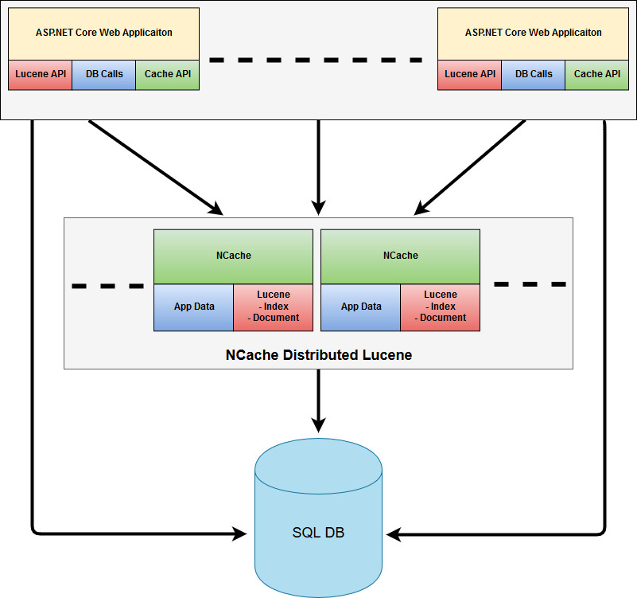
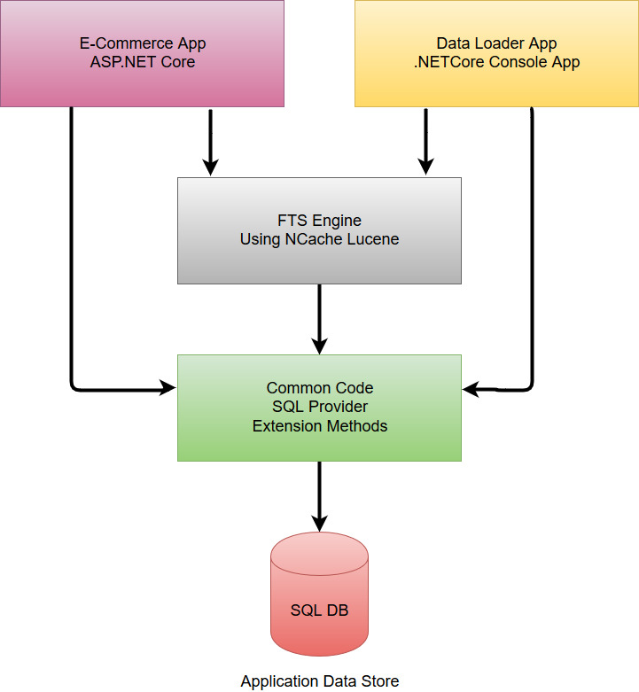

# Lucene Full-Text Search Demo with NCache

A simple full-text search demo application using NCache Lucene module based on Lucene.Net 4.8 Beta 5. This simple application demonstrates how you can incorporate Lucene based full-text search in your e-commerce app (or any other application) using Lucene with NCache, and that also with only a single line code change!

## An Overview of Full-Text Search (FTS) Using Lucene With NCache
Full-text search is a text searching technique to find the most relevant data from unstructured text data which matches the provided search criteria. It is used to quickly find all occurrences of the term (word), without scanning all of your textual data (all rows in a DB or all text files, etc.). Full-text search is based on the concept of 'inverted index', it is an index data structure that tracks every term (word) to its location in the documents (records).

Lucene is the most popular .NET full-text search engine. Lucene in itself is a standalone full-text search engine, hence not scalable at all and prone to a single point of failure. NCache makes Lucene scalable by providing its support as fully distributed & scalable cache cluster. NCache has the capabilities to scale-out or scale-in depending on your application load. Hence, all of these benefits are provided without taking the control away from the developer and within the landscape of Lucene API.



### Indexing
Before performing the search, you have to index the data which you want to search using Lucene. Every single record stored in Lucene is called a *document*. Each document consists of one or more *fields*. A field is key-value pair of a *term* and *term value*. Term values can be binary, numeric, date or text. Here is a sample document (in JSON) with few fields of a sample `Product` class: 

```json
{
    "Id": "ACCDSY8EDTGSEZD5",
    "Name": "HP Pavilion G71 6 Cell Laptop Battery",
    "Category": "Computers",
    "Description": "HP Pavilion G71 6 Cell Laptop Battery ...",
    ...
}
```

### Index Building Strategies
There are few important points which you need to consider before building a Lucene index in your application like:
* Lucene is a Full-Text Search engine, not a database store, so use it accordingly.
* Lucene supports different data types like Text, Numeric, Binary, etc., but it is best for textual data.
* When you index your searchable textual data in Lucene, also store your primary identifier (primary key/file name/page number/etc.) along with it, so you can link it back to your actual data store. 
* Take a new instance of the `IndexSearcher` before every search, to make sure that search is being performed on the updated index.

Now let's add some documents with your selected fields (instead of all fields), to create a FTS (Full Text Search) index:

```csharp
public int CreateIndexInBulk()
{
    int count = 0;
    IList<Document> docs = new List<Document>();
    // Fetch data from data source
    using (var enumerator = dataProvider.GetProductFTSEnumerator())
    {
        while (enumerator.MoveNext())
        {
            docs.Add(enumerator.Current.GetLuceneDocument());

            count++;
            // Instead of performing commit at the end of all records do it after a chunk of documents
            if (docs.Count == BULK_SIZE)
            {
                indexWriter.AddDocuments(docs);

                //Flush and make it ready for search
                indexWriter.Commit();
                docs.Clear();
                //Remove the added documents
            }
        }
        // Write the last chunk of documents
        if (docs.Count > 0)
        {
            indexWriter.AddDocuments(docs);
            // Flush and make it ready for search
            indexWriter.Commit();
        }
    }
    return count;
}
```

The following code demonstrates how to build Lucene a document using the provided instances of your class object:

```csharp
public static Document GetLuceneDocument(this ProductFTS product)
{
    Document doc = null;
    if (product != null)
    {
        doc = new Document
        {
            new TextField("name", product.Name, Field.Store.YES),
            new TextField("description", product.Description, Field.Store.YES),
            
            //StringField stored as is without perfroming tokanization
            new StringField("category", product.Category, Field.Store.YES),
            
            //StoreField stored but without analysis and indexing
            new StoredField("id", product.ID),
            new StoredField("retail_price", product.RetailPrice),
            new StoredField("discounted_price", product.DiscountedPrice),
            doc.Add(new StoredField("image", product.ImageUrl));
        };
    }
    return doc;
}
```

### Searching
Searching is performed on indexes created during document writing in Lucene. Once an index is built, you can search the required data using a Lucene query. The result of the query is a set of Lucene's internal document IDs which match the specified query data (term).

The code snippet below converts the user provided search term into a Lucene query, and then performs the search based on this query.

```csharp
public Tuple<long, List<ProductFTS>> Search(string searchTerm, int top = TOP_LIMIT, string category = null)
{
    long totalHits = 0;
    var repoList = new List<ProductFTS>();
    try
    {
        TopDocs topDocs = null;
        var queryParser = new MultiFieldQueryParser(Version, Fields, analyzer);

        var query = new BooleanQuery();
        // For exact match use the queryParser.Parse(searchTerm)
        query.Add(queryParser.Parse(searchTerm), Occur.MUST);

        // Split the search term into multiple search words to make fuzzy query 
        string[] terms = searchTerm.Split(new[] { " " }, StringSplitOptions.RemoveEmptyEntries);
        foreach (string term in terms)
        {
            query.Add(queryParser.Parse(term.Replace("~", "") + "~"), Occur.MUST);
            // Remove the duplicate ~, if it already exists
        }

        // Search with given query
        if (!string.IsNullOrEmpty(category))
        {
            var filter = new QueryWrapperFilter(new TermQuery(new Term(CATEGORY_FIELD, category)));
            topDocs = searcher.Search(query, filter, top, Sort.RELEVANCE);
        }
        else
        {
            topDocs = searcher.Search(query, top, sort: Sort.RELEVANCE);
        }
        totalHits = topDocs.TotalHits;
        repoList = GetSearchedDocs(searcher, topDocs);
    }
    catch (Exception exc)
    {
        // Handle exception
    }
    return new Tuple<long, List<ProductFTS>>(totalHits, repoList);
}
``` 

Lucene returns IDs of the matched documents in the query result, so you can fetch the documents by calling `IndexSearch.Doc()` method by providing it the document ID like this:

```csharp
protected List<ProductFTS> GetSearchedDocs(IndexSearcher searcher, TopDocs topDocs)
{
    var prodList = new List<ProductFTS>();
    //ScoreDocs return top hits for the current
    foreach (var result in topDocs.ScoreDocs) search
    {
        //Get the actual document by providing its id
        var doc = searcher.Doc(result.Doc);
        prodList.Add(doc.GetProductFTS());
    }
    return prodList;
}
```

## Full-Text Searching in an ASP.NETCore E-Commerce Sample App
This is a sample E-Commerce ASP.NET Core demo application to demonstrate the Full-Text Search usage with Lucene using NCache. Its actual data store is a rational database (SQL Server) to permanently store all of its data. Instead of storing all relational data in Lucene, few of the textual data fields like Name, Description on which we want to perform the search are stored in Lucene indexes.

First, we feed our required fields as part of the Lucene document into NCache using its Lucene integration. We only index its textual fields (Description and Name), and also store (without analyzing & indexing) few other required fields like its identity column 'id', Price and Product Image URL.

> NOTE: If you are not storing all of your fields in Lucene (which is standard practice), make sure to store your primary key or identifier in Lucene, so that you can fetch the full record from the database when needed after searching it.



### NCommerce Web (ASP.NET Core App)
This is the main application with which the user will interact to view and search the products. It is the front-end of the e-commerce store built using ASP.NET Core MVC to provide the search option for this e-commerce store.

### DataLoader (.NETCore Console App)
This is a simple console application to provide options to add, update and remove indexes. It uses the `FTSEngine` module to actually perform the index creation task in Lucene. It provides the options to load documents individually or in bulk.

> NOTE: Run this application whenever you want to push new products in Lucene.

### FTSEngine (.NETCore Class Library)
This is a class library project which encapsulates all Full-Text Search related functionalities including index creating and search. All of the Lucene code to create indexes and perform searches is encapsulated in it.

### Common (.NETCore Class Library)
This is a class library, which contains all the common classes & methods required by web-app and data loader console app. It also contains the data providers like:
* An `SQLProvider` to interact with backend SQL database
* `CacheableDataProvider` which uses NCache to store most frequently searched products in the cache for faster access.

> NOTE: For this demo project, we are using free data available at [kaggle.com](https://www.kaggle.com/PromptCloudHQ/flipkart-products), and filtered it to remove any garbage values from it.

## Application Data Caching with NCache
Along with full-text search in the web application, it also caches its database queries result to speed up subsequent fetches for the already cached products. Along with the benefit of faster data access from in-memory cache, it also reduces the database trips.

```csharp
public Product GetProduct(string prodId)
{
    ThrowErrorIfDisposed();

    Product product = _cache.Get<Product>(prodId);
    if (product != null)
    {
        return product;
    }
    else // Fetch it from database
    {
        SqlCommand sqlCommand = new SqlCommand
        {
            CommandText = "SELECT * FROM products WHERE id = '" + prodId + "'",
            Connection = _sqlConnection,
        };

        using (var reader = sqlCommand.ExecuteReader())
        {
            while (reader.Read())
            {
                product = reader.GetProduct();
                break;
            }
        }

        // Store it in cache for future use
        _cache.Insert(prodId, product);
        return product;
    }
}
```

# How to use this sample?
This application consists of multiple projects as described above. Follow these steps to use this application:

## Step 1. Load the data into your SQL instance
A .sql compressed file is placed inside the *resources* folder which contains the *ncommerce.sql* SQL script file. On executing this file (in SSMS or SQLCMD), it will create a `ncommerce` database, which has the `Products` table, along with 'ncommerce' SQL server based login.

### Using SQL Server Management Studio (SSMS)
* Open SQL Server Management Studio (SSMS)
* Click on menu **File** -> **Open** -> **File** -> navigate to the *ncommerce.sql* file.
* After the file has opened, you can click F5 to run the SQL script.

### Using SQLCMD commonline tool
* Open a Command Prompt window
* In the terminal, type: `sqlcmd -S myServer\instanceName -i path/to/ncommerce.sql`
* Press ENTER


## Step 2. Download & install the latest versions of NCache

If you do not have NCache installed on your machine, you can always download the latest version of NCache from [alachisoft.com](http://www.alachisoft.com/download-ncache.html). 
This application is built using NCache 5.0.

* After downloading NCache, follow NCache [Install Guide](http://www.alachisoft.com/resources/docs/ncache/install-guide/install-ncache-net.html) to install NCache. After installation, you can manage it from its web management application, NCache Web Manager.
  
> Open a web browser, copy and paste the URL below and hit the ENTER key. It will launch NCache Web Manager.
> http://localhost:8251

* Now create two caches named as '*lucenecache*' & '*datacache*'. Follow the [Getting Started Guide](https://www.alachisoft.com/resources/docs/ncache/getting-started-guide-windows/) by NCache to create and manage caches. You can always consult NCache online documentation for more [info](http://www.alachisoft.com/resources/docs/).

> Make sure that Lucene index is enabled for this newly created 'lucenecache' cache. You can enable it through [Web Manager](http://www.alachisoft.com/resources/docs/ncache/admin-guide/configuring-lucene-query-indexes.html) or PowerShell tool [Enable-LuceneIndex](http://www.alachisoft.com/resources/docs/ncache/powershell-ref/enable-lucene-index.html).

## Step 3. Open NCache E-commerce project with Visual Studio

This project is built using Visual Studio 2019. If you do not have it, you can download it from Micorosft [website](https://visualstudio.microsoft.com/vs/community/).
Launch Visual Studio to open and compile this application:
1. Open Visual Studio.
2. Open the NCommerce solution file (NCommerce.sln).
3. Right-click on the solution **NCommerce** and in the dropdown menu click on **Restore Nuget Packages**.
4. Now again right-click on the solution **NCommerce**, and choose **Build Solution**.

## Step 4. Load data into NCache using DataLoader Console App

1. Right-click on the **DataLoader** project.
2. Go to the **Debug** sub-menu and click on **Start New Instance**
3. In the newly launched console DataLoader app, press the letter "B" to select the bulk load option, to add documents & create a full-text index.
4. Finally, close this application by pressing "Q" or clicking on the close button.

## Step 5. Launch the NCommerceWeb application to search products

Now back in Visual Studio, hit the F5 button to launch the NCommerceWeb application. Using it you can search your required product(s) by typing its name or description in the search box and clicking on the **Search** button.

* If you want to search the given word for a specific category, choose it from the *Category* dropdown list, enter your search word or phrase (multiple words) and click on the **Search** button.
* You will be presented with products which were found as the result of your search criteria, using Lucene.
* If you want to see the details of any of the products returned, click on its name or image to see its full details in a new page.

> NOTE: Object caching is also used when you view the individual product.

