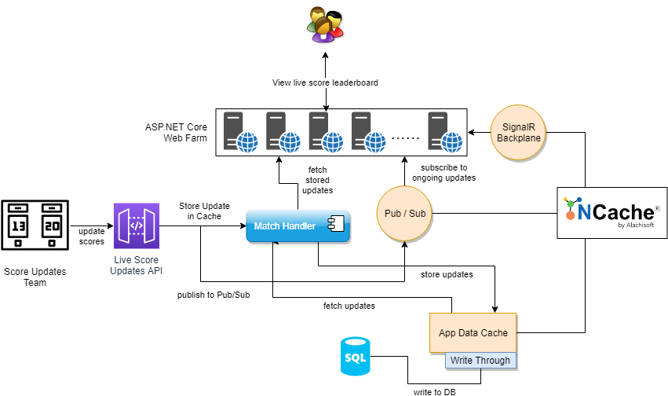

# Live Score Leaderboard Using NCache

### Table of contents

* [Introduction](#introduction)
* [Getting Started](#getting-started)
* [Working](#working)
* [Built With](#built-with)
* [Additional Resources](#additional-resources)

## Introduction
This project is a high level demonstration of how a live score leaderboard app (or a sports website featuring live updates) must be created. It explains the features required and how NCache can help in attaining the required performance.

## Getting Started

These instructions will get you a copy of the project up and running on your local machine for development and testing purposes. See deployment for notes on how to deploy the project on a live system.

### Prerequisites

Following are required before you can run this app:

 - NCache Enterprise (version 5.0)
 - DotNET Core Runtime (version 2.2)
 - DotNET Core SDK (version 2.2)
 - IISExpress (version 10)
 - Visual Studio (VS2017)

Note that the app has been tested with the mentioned versions.

### Installing
*Please ensure that the prerequisites are installed before continuing.*

#### Create Cache
A cache needs to be linked with the app. 
On installing NCache, two caches are created by the name of `mypartitionedcache` and `myreplicatedcache`.
If the default cache is not available, Create a new cache.

#### Link Cache with App

Mention this cache name in "CacheName" attribute of following files:
1.`\LiveScoreLeaderboard\LiveScoreLeaderboard\appsettings.json`
2. `\LiveScoreLeaderboard\WebAPI\appsettings.json`

    {
		"CacheName":  "mypartitionedcache"
	}

### Starting the App
This solution contains three projects:
1. LiveWebApp
2. WebAPI
3. MatchHandler

build the project in windows environment and run LiveWebApp and WebAPI in IIS Express using Visual Studio.
Upon running, two separate browser windows will be opened:
1. LiveWebApp opens a page showing the window where scores will be listed.
2. WebAPI opens a demo page containing buttons and update options.

## Working

Following is an explanation to the working of different parts of this live score leaderboard app.

### User Roles
The app has two main users

 1. User watching the live score
 2. User that provides score updates

#### User watching Live Score
This user visits the web app on which the live scores are available.

#### User that provides score updates
This user updates scores through a public API.

### App flow

Here is how the app functions:

#### For user watching live scores
 1. The user opens the web app in his browser
 2. The request is sent to ASP.NET Core web farm through a load balancer
 3. The user gets connected to a live score feed through SignalR. If a match is already ongoing, the match details and updates are populated on the screen along with the live scores.

#### For user providing score updates
 1. The user sends live updates about the match through the public API
 2. The request is sent to ASP.NET Core web farm handling the API
 3. The API publishes as well as stores these updates in NCache
 4. Updates are also saved in the database

### Architecture
All parts of the app are connected to an NCache feature. Following is a detail on each feature's implementation and use:

#### SignalR Backplane
To keep connections persistent across multiple servers in a web farm, an NCache provider is given with the installation that can be added to any SignalR app. The provider is added to SignalR configuration.

Following is a part of the configuration to be done to attach NCache backplane to SignalR:
```
<configuration>
	<appSettings>
		<add key="cache" value="myPartitionedCache"/>
		<add key="eventKey" value="Chat"/>
	</appSettings>
</configuration>
```

#### Pub/Sub

To manage live match updates and provide latest updates to the user, each web app subscribes to match topics that are currently live. Updates are published on different ongoing match topics. These are obtained by ASP.NET core servers and pushed to client through SignalR. 
There can be multiple live update sources publishing updates and multiple ASP.NET Core servers listening to these updates.

Handling Pub/Sub in NCache can be done in the following way:
##### Creating Topic
```
// create pub/sub topic on match start
_cache.MessagingService.CreateTopic(matchName);
```
##### Fetch Topic
```
// fetch topic handler from cache
ITopic topic = _cache.MessagingService.GetTopic(matchName);
```
##### Publish to Topic
```
// publish Message on topic
topic.Publish(message, DeliveryOption.All);
```
##### Subscribe to Topic
```
// subscribe this server to ongoing match topic
_cache.MessagingService.GetTopic(matchName).CreateSubscription(_selfSubscribe);
```

#### App Data Cache
While ongoing match updates are delivered by subscribing to different topics, each update is separately cached as well to allow quick retrieval for newly joined clients. These updates are cached in the distributed memory.

#### Write-Through
Not only the updates are stored in distributed memory, but these are also stored in the database when saved to cache.

#### Read-Through
When ongoing match updates are being fetched from cache, data stored in database can be retrieved to populate cache as well as serve user.

## Built With

### Technology Used

* [NCache](http://www.alachisoft.com/ncache/) - Distributed Cache for .NET
* [SignalR](https://dotnet.microsoft.com/apps/aspnet/real-time) - Real-time ASP.NET

### Development Tools

* [Visual Studio 2017](https://visualstudio.microsoft.com/)- For creation of project and code

## Additional Resources

#### Documentation
The complete online documentation for NCache is available at:
http://www.alachisoft.com/resources/docs/#ncache

#### Programmers' Guide
The complete programmers guide of NCache is available at:
http://www.alachisoft.com/resources/docs/ncache/prog-guide/

## Technical Support

Alachisoft [C] provides various sources of technical support. 

- Please refer to http://www.alachisoft.com/support.html to select a support resource you find suitable for your issue.
- To request additional features in the future, or if you notice any discrepancy regarding this document, please drop an email to [support@alachisoft.com](mailto:support@alachisoft.com).

## Copyrights

[C] Copyright 2019 Alachisoft