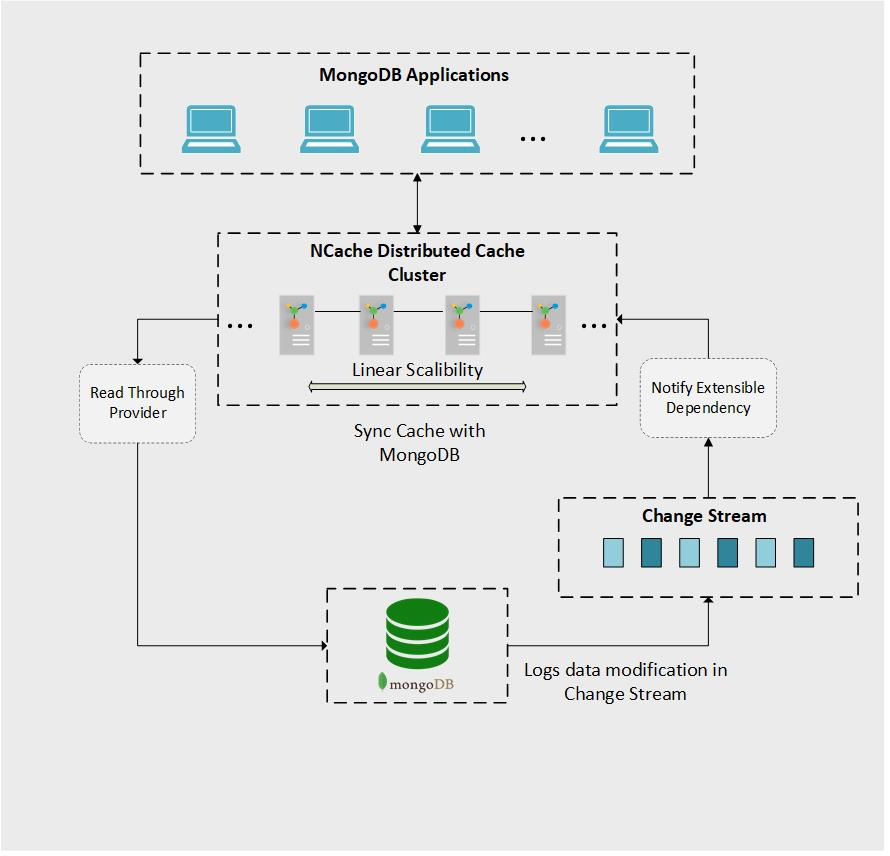
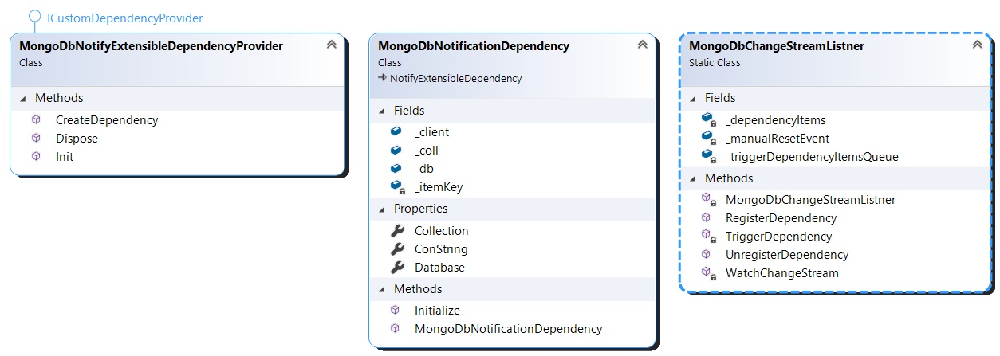

# Sync NCache with Mongo DB using NotifyExtensibleDependency

## Table of contents

* [Introduction](#introduction)
* [Prerequisites](#pre-requisites)
* [Implementation](#implementation)
* [NCache Features Highlighted in Application](#ncache-features-highlighted-in-application)
* [Running the Application](#running-the-application)
* [Additional Resources](#additional-resources)
* [Technical Support](#technical-support)
* [Copyrights](#copyrights)

## Introduction

This project highlights the NCache **NotifyExtensibleDependency** feature and how it can be used to synchronize NCache with Mongo DB collections. [**NotifyExtensibleDependency**](https://www.alachisoft.com/resources/docs/ncache/prog-guide/notification-extensible-dependency.html) is a cache synchronization strategy for tackling the stale data problem, to be discussed shortly. Its primary purpose is to give the solution architect the flexibility to integrate a **real-time customized** logic that monitors and processes datastore change notifications **directly** into the cache hosting processes running on the cache servers. 

In this scheme, the developer deploys a provider containing the datastore state-change monitoring and processing logic behind the depedency along with the lifecycle hooks into the NCache servers. The servers then invoke the dependency-related methods which encapsulate the custom logic and determine whether or not to remove the associated cached item. The main strengths of this feature are as follows:

- **Stale Data Problem Mitigation**

  Although using NCache with Mongo DB boosts application performance, there is one issue that needs to be kept in mind. When you start   caching with a primary data store such as Mongo DB, two copies of the same data will be created, one in the primary data store and     the other in the cache. Any direct update to the database data could render the cache data stale. With **NotifyExtensibleDependency**,   not only are we taking advantage of the increased read performance provided by NCache, but we can also make sure that stale data does   not persist in the cache.

- **Native NCache API Support**

  With support built into the NCache core logic, **NotifyExtensibleDependency** extends the power NCache provides when it comes to **high availability**, **reliability** and **scalability** and adds the mechanisms which ensure that cached-data fully agrees with the primary datastore state at all times.
  
With cache synchronization logic deployed to the cache servers using **NotifyExtensibleDependency**, the overall architecture including NCache and the [Mongo DB Change Stream](https://docs.mongodb.com/manual/changeStreams/) can be visualized as in the figure given below. This diagram also highlights the use of a [read-through provider](https://www.alachisoft.com/resources/docs/ncache/prog-guide/read-through-caching.html) to allow for **auto-reloading** updated data into the cache:




The following are the advantages of NCache together with this feature when used with Mongo DB:

- **Faster Read Operations**

  Using NCache as your distributed caching solution, application performance is improved since it is an in-memory key-value store which   greatly improves data read performance. More information about using caching   with Mongo DB can be found [here](https://www.alachisoft.com/blogs/how-to-sync-cache-with-mongo-db/). 
  
- **Improved Scalability**

  Using **NotifyExtensibleDependency**, all the cache synchronization operations are handed over to the clustered cache itself, allowing   the clients to focus on the core business logic. Not only does this create a clean logical separation of concerns among the NCache       client and servers but it also provides improved scalability of the overall system architecture since any increase in change stream       load can easily be handled by scaling out the NCache cluster independently of the client-side infrastructure, an important implication for today's cloud-based microservices applications. 
 
## Pre-requisites

  Before running the application, make sure the following requirements have been met:

  - Windows 10 64-bit development machines with [.NET Framework 4.8 runtime](https://dotnet.microsoft.com/download/dotnet-framework/net48) for hosting the NCache servers.
  - The latest [Mongo DB Instance](https://docs.mongodb.com/manual/tutorial/install-mongodb-on-windows/) configured for remote network access. You can configure it for remote access by replacing *127.0.0.1* to *0.0.0.0* in **bindIp** tag in **mongod.cfg** file and then restarting the Mongo DB service.
  - You must have read permission for the Mongo DB instance you are using.
  - Make sure that your Mongo DB instance is a Replica Set instead of stand-alone. Change Streams does not function on stand-alon instances. [Here](https://docs.mongodb.com/manual/tutorial/convert-standalone-to-replica-set/) is how you can convert Stand-Alone into a Replica Set. 
  - An IDE to run the code such as [Visual Studio 2019](https://visualstudio.microsoft.com/).
  - The .NET Core 3.1 SDK and Runtime environments have been installed to compile and package the application. Those can be installed from [here](https://dotnet.microsoft.com/download/dotnet/3.1).
  - **NCache 5.2 Enterprise edition** is installed on the cache server machines. The installation files can be found [here](https://www.alachisoft.com/download-ncache.html).
  
## Implementation
 We can finally get to writing our code. The overall UML diagram of our implementation is shown below:



The following is our implementation of the ICustomDependencyProvider interface that is responsible for providing the Notify Extensible Dependency instance:

[MongoDbNotifyExtensibleDependencyProvider.cs](.\MongoDbNotificationDependency\MongoDbNotifyExtensibleDependencyProvider.cs)
```csharp 
[Serializable]
class MongoDbNotifyExtensibleDependencyProvider : ICustomDependencyProvider
{
    public ExtensibleDependency CreateDependency(string key, IDictionary<string, string> parameters)
    {
        // Validate all values passed in parameters dictionary

        return new MongoDbNotificationDependency(
            key,
            parameters["ConString"],
            parameters["DatabaseName"],
            parameters["CollectionName"]
            );
    }

    public void Dispose()
    {
    }

    public void Init(IDictionary<string, string> parameters, string cacheName)
    {
    }
}
```

The following is our implementation of the NotifyExtensibleDependency class:

[MongoDbNotificationDependency.cs](.\MongoDbNotificationDependency\MongoDbNotificationDependency.cs)
```csharp
[Serializable]
public class MongoDbNotificationDependency : NotifyExtensibleDependency
{
    public static string ConString { get; set; }                        // MongoDB connection string
    public static string Database { get; set; }                         // MongoDB dtabase name
    public static string Collection { get; set; }                       // MongoDB collection name to be watched

    public static MongoClient _client;                                  // MongoDB client instance
    public static IMongoDatabase _db;                                   // MongoDB database instance
    public static IMongoCollection<Customer> _coll;                     // MongoDB collection instance

    private string _itemKey;                                            // Dependent item's key

    public MongoDbNotificationDependency(string itemKey, string conString, string db, string coll)
    {
        ConString = conString;
        Database = db;
        Collection = coll;
        _itemKey = itemKey;
    }

    // This function is called everytime when an item is inserted in cache with dependency.
    public override bool Initialize()
    {
        try
        {
            _client = new MongoClient(ConString);
            _db = _client.GetDatabase(Database);
            _coll = _db.GetCollection<Customer>(Collection);

            // Method of a static class MongoDbChangeStreamListner that registers dependency of a cache item.
            MongoDbChangeStreamListner.RegisterDependency(_itemKey, this);
        }
        catch (Exception)
        {
            return false;
        }
        return true;
    }
}
```
The following shows the implementation of the [Change Stream](https://docs.mongodb.com/manual/changeStreams/) used to create the change stream listner whose instance will listen to and process the change stream results for our custom MongoDbNotificationDependency instances:

[MongoDbChangeStreamListner.cs](.\MongoDbNotificationDependency\MongoDbChangeStreamListner.cs)
```csharp
[Serializable]
public static class MongoDbChangeStreamListner
{
    private static Dictionary<string, MongoDbNotificationDependency> _dependencyItems;  // Contains items having dependency
    private static Queue<string> _triggerDependencyItemsQueue;  // Contains items for which dependency is to be triggered
    private static ManualResetEvent _manualResetEvent;          // Task awaiter

    static MongoDbChangeStreamListner()
    {
        _dependencyItems = new Dictionary<string, MongoDbNotificationDependency>();

        _triggerDependencyItemsQueue = new Queue<string>();

        _manualResetEvent = new ManualResetEvent(false);

        Task changeStreamListnerTask = new Task(() => WatchChangeStream());     // This task listens to the MongoDB change stream
        changeStreamListnerTask.Start();

        Task triggerDependencyTask = new Task(() => TriggerDependency());       // This task triggers dependencies
        triggerDependencyTask.Start();
    }

    // Registers cache items having dependency on database items
    public static void RegisterDependency(string cacheKey, MongoDbNotificationDependency dependencyObject)
    {
        lock (_dependencyItems)
        {
            _dependencyItems.Add(cacheKey, dependencyObject);
        }
    }

    // Unregisters cache items having dependency on database items
    public static void UnregisterDependency(string cacheKey)
    {
        lock (_dependencyItems)
        {
            _dependencyItems.Remove(cacheKey);
        }
    }

    // Listening to MongoDB change stream and marks items to be removed when data in database updates.
    private static void WatchChangeStream()
    {
        // Filtering the change stream to get only Update events.
        var pipeline = new EmptyPipelineDefinition<ChangeStreamDocument<Customer>>()
            .Match(c => c.OperationType == ChangeStreamOperationType.Update);

        // Asking change stream to return full document on update event.
        var changeStreamOptions = new ChangeStreamOptions()
        {
            FullDocument = ChangeStreamFullDocumentOption.UpdateLookup
        };

        // Starting listening to change stream
        using (var cursor = MongoDbNotificationDependency._coll.Watch(pipeline, changeStreamOptions))
        {
            foreach (var change in cursor.ToEnumerable())
            {
                string key = "Customer:" + change.FullDocument.CustomerId;
                if (_dependencyItems.ContainsKey(key))
                {
                    lock (_triggerDependencyItemsQueue)
                    {
                        _triggerDependencyItemsQueue.Enqueue(key);          // Adding item in Queue to trigger dependency

                        _manualResetEvent.Set();                            // Resuming the dependency trigger task
                    }
                }
            }
        }
    }

    // Triggers dependency agains stale items in cache
    private static void TriggerDependency()
    {
        while (true)
        {
            try
            {
                _manualResetEvent.WaitOne();                            // Pausing the task to save resources

                string key;
                lock (_triggerDependencyItemsQueue)
                {
                    key = _triggerDependencyItemsQueue.Dequeue();
                }
                lock (_dependencyItems)
                {
                    _dependencyItems[key].DependencyChanged.Invoke(_dependencyItems[key]);

                    UnregisterDependency(key);                          // Removing item from dependent items dictionary
                }
            }
            catch (Exception)
            {
                _manualResetEvent.Reset();
                continue;
            }
        }
    }
}
```

Once the project is built and assemblies created, deploy the assemblies to a cache using the method shown in [NCache Notify Extensible Dependency Documentaion](https://www.alachisoft.com/resources/docs/ncache/prog-guide/notification-extensible-dependency.html#step-3-deploy-implementation-on-cache). After this is done, you can start the cache.
Once the cache is started, we can test that the dependency is working. Below is a code snippet showing how an item can be inserted into cache with dependency on data present in Mongo DB database:
```csharp
string providerName = "MongoDbNotifyExtensibleDependencyProvider"; //This is the name of your provider deployed on cache server

IDictionary<string, string> parameters = new Dictionary<string, string>();
parameters.Add("ConString", "mongodb://**.**.**.**:27017");
parameters.Add("DatabaseName", "customerscollection");
parameters.Add("CollectionName", "customers");

CacheItem item = new CacheItem(customer);
item.Dependency = new CustomDependency(providerName, parameters);

_cache.Insert("Customer:1001", item);
```
Now that the item is in the cache along with the dependency metadata encapsulating the parameters of the database state it is concerned with, any update on the item with the specified key on the database side will be observed by a change stream listner instance running on the servers and the dependency will be invoked, triggering the removal of the stale cache data.

## NCache Features Highlighted in Application

Here is the main feature of the application demonstrating **NotifyExtensibleDependency**:

  - **Server-Side Cache Synchronization Logic**
  
    As mentioned in the [introduction](#introduction), **NotifyExtensibleDependency** allows for custom logic to be deployed server-side. For this application that demontrates its use with Mongo DB Change Stream. Details of the NotifyExtensibleDependency implementation can be found [here](.\MongoDbNotificationDependency\MongoDbNotificationDependency.cs).
    

## Running the Application

  Here are the steps for running the application:
  
  - Make sure to update the NCache server information in the [**client.ncconf**](https://www.alachisoft.com/resources/docs/ncache/admin-guide/client-config.html) files included in the 
  [console application project](./MongoDbNotifyExtensibleDependencyTest/). This server information includes the cache ID of the cache to be created and the IP address of atleast one of the servers that will be used.
  - Build and package the application and make sure the assemblies have been successfully generated.
  - Using the [NCache Web Manager GUI](https://www.alachisoft.com/resources/docs/ncache/admin-guide/ncache-web-manager.html?tabs=windows%2Cwindows-start-manager), create a [**partitioned-of-replica**(POR)](https://www.alachisoft.com/ncache/caching-topology.html#partitionedreplica) clustered cache using the steps given [here](https://www.alachisoft.com/resources/docs/ncache/admin-guide/create-new-cache-cluster.html?tabs=windows#using-ncache-web-manager). Make sure the cache ID and IP address of the nodes agree with the values given in the [**client.ncconf**](.\MongoDbNotifyExtensibleDependencyTest\client.ncconf) and cache ID given in [**App.config**](.\MongoDbNotifyExtensibleDependencyTest\App.config) is the same as the entry in the **client.ncconf** file. 
  
  **Note: Although you can use any cache topology with the application without changing the source code, the POR topology adds reliability with data-paritioning and best demonstrates the capabilities of NCache when a balance between reliability and performance is required.** 
  - Stop the demo cache if it is running and deploy the built [NotifyExtensibleDependency](./MongoDbNotificationDependency/) project assemblies on the cache servers and provide a unique provider name . The steps for doing this are shown [here](https://www.alachisoft.com/resources/docs/ncache/admin-guide/configure-custom-dependency.html).
  - Make sure to deploy all the dependent assemblies for your provider on the cache as well. [Here](https://www.alachisoft.com/resources/docs/ncache/admin-guide/deploy-providers.html) is how you can do this.
  - Once the logic is deployed, re-start the cache to get the integration assemblies included in the cache host process.
  - Update the cache name, provider name, connection string, database name, and collection name values for the Mongo DB instance in the [**App.config**](.\MongoDbNotifyExtensibleDependencyTest\App.config) file.
  - Before starting the application, confirm again that the cache and the Mongo DB instance are running and that the machines hosting the NCache servers can access the Mongo DB instance.
  - [Open the statistics window of the running cache](https://www.alachisoft.com/resources/docs/ncache/admin-guide/browse-cache-statistics.html?tabs=windows#ncache-web-manager) to view data as it is added to the cache in real time. Start the application and watch as the items are first added and then removed when the documents are updated in the database due to the dependencies on the cached items being invoked.  
  

## Additional Resources

### Documentation
The complete online documentation for NCache is available at:
[http://www.alachisoft.com/resources/docs/](http://www.alachisoft.com/resources/docs/)

### Programmers' Guide
The complete programmers guide of NCache is available at:
[http://www.alachisoft.com/resources/docs/ncache/prog-guide/](http://www.alachisoft.com/resources/docs/ncache/prog-guide/)

## Technical Support

Alachisoft &copy; provides various sources of technical support. 

- Please refer to [Alachisoft Support](http://www.alachisoft.com/support.html) to select a support resource you find suitable for your issue.
- To request additional features in the future, or if you notice any discrepancy regarding this document, please drop an email at [support@alachisoft.com](mailto:support@alachisoft.com).

### Copyrights

&copy; Copyright 2021 Alachisoft 