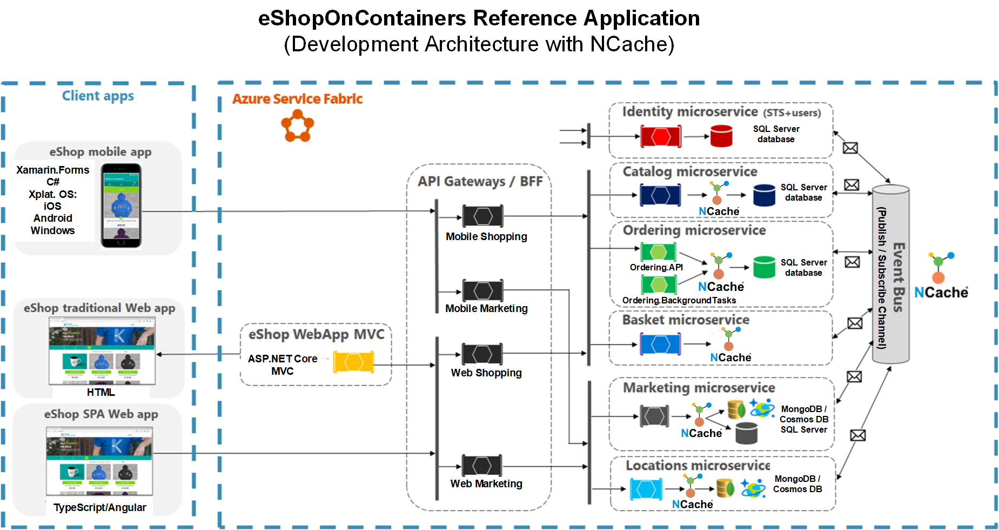

# Microservices with NCache in Service Fabric

## Table of contents

* [Introduction](#introduction)
* [Prerequisites](#pre-requisites)
* [NCache Features Highlighted in Application](#ncache-features-highlighted-in-application)
* [Running the Application](#running-the-application)
* [Additional Resources](#additional-resources)
* [Technical Support](#technical-support)
* [Copyrights](#copyrights)

## Introduction

This project uses the popular [eShopOnContainers](https://github.com/dotnet-architecture/eShopOnContainers) repository to create microservices that run in an [Azure Service Fabric](https://docs.microsoft.com/en-us/azure/service-fabric/service-fabric-overview) and highlights how NCache can be used as a resilient, distributed, in-memory [Pub/Sub messaging broker](https://docs.microsoft.com/en-us/azure/architecture/patterns/publisher-subscriber) as well as a scalable, highly-available storage provider for [caching](https://docs.microsoft.com/en-us/azure/architecture/best-practices/caching) and [data protection services](https://docs.microsoft.com/en-us/aspnet/core/security/data-protection/introduction?view=aspnetcore-2.2). Following is the overall architectural diagram of the solution given in this repository:



While a sample of **eShopOnContainers** application using NCache is already available on the Alachisoft [NCache GitHub repository](https://github.com/Alachisoft/NCache-Solutions/tree/master/eShopOnContainers), that sample uses Docker to containerize the micoroservices and utilizes Docker Compose as the orchestrator to set-up the microservices-based application. In this solution, on the other hand, the microservices have been set up as Service Fabric [reliable stateless services](https://docs.microsoft.com/en-us/azure/service-fabric/service-fabric-reliable-services-introduction). The reasons for introducing the same application implemented for a Service Fabric deployment and using its reliable stateless service architecture are as follows:

- Even though Docker Compose is a great tool used frequently during development stages, in a production environment, however, especially when the application is to be deployed to the cloud, it is recommended to use an orchestrator such as Azure Service Fabric instead of Docker Compose.

- Re-architecting an existing application as a Service Fabric reliable service is very straightforward and requires minimal changes in the structure. This can be seen by comparing the code in the [previously-implemented solution](https://github.com/Alachisoft/NCache-Solutions/tree/master/eShopOnContainers) with the current one. In return, your application is opened up  to a whole suite of Service Fabric APIs for [system monitoring and diagnostics](https://github.com/MicrosoftDocs/azure-docs/blob/master/articles/service-fabric/service-fabric-tutorial-monitoring-aspnet.md), [health reporting](https://docs.microsoft.com/en-us/azure/service-fabric/service-fabric-report-health), and [much more](https://docs.microsoft.com/en-us/azure/service-fabric/service-fabric-reliable-services-introduction).

In an Azure environment, Service Fabric is a natural choice as Azure has an extensive built-in engine to allow for setting up the resources for a Service Fabric cluster using tools such as [Azure CLI](https://docs.microsoft.com/en-us/cli/azure/?view=azure-cli-latest) as well as the [Azure Resource Manager (ARM)](https://docs.microsoft.com/en-us/azure/azure-resource-manager/resource-group-overview).

Furthermore, the online GUI tools available in Azure for setting up a Service Fabric resource together with all its auxiliary  dependencies such as VNET and VM scale set resources, in addition to the ability of exporting the set-up as an ARM template, means that one can get started with Azure Service Fabric without first having to acquire extensive background information.

## Pre-requisites

Before running the application, make sure the following requirements have been met:

- Windows 10 development machines for hosting the Service Fabric cluster.
- You will need to install the latest [Service Fabric SDK tools](https://docs.microsoft.com/en-us/azure/service-fabric/service-fabric-get-started).
- [Install Visual Studio 2019](https://visualstudio.microsoft.com/) version 15.5 or later with the **Azure development** and **ASP .NET and web development** workloads.
- The .NET Core 2.2 SDK and Runtime environments have been installed to compile and package the application. Those can be installed from [here](https://dotnet.microsoft.com/download/dotnet-core/2.2).
- **NCache 5.0 SP1 Enterprise edition** is installed on the cache servers. The installation files can be found [here](https://www.alachisoft.com/download-ncache.html).
- Make sure to update the NCache server information in the [**client.ncconf**](https://www.alachisoft.com/resources/docs/ncache/admin-guide/client-config.html) files included in each solution project. You also have the option of [creating caches](https://www.alachisoft.com/resources/docs/ncache/admin-guide/create-new-cache-cluster.html) with the IDs already given in the client.ncconf files and just update the IP addresses in the [ApplicationManifest.xml](https://docs.microsoft.com/en-us/azure/service-fabric/service-fabric-application-and-service-manifests) file parameter section to match the node IP addresses of the corresponding caches. You can override these default values in the xml files located in the **ApplicationParameters** folder of the ServiceFabricApp project given in the solution.
- The cache to be used for Pub/Sub messaging between the microservices is common to all the microservices and, as such, should have **identical values for the cluster node IP addresses and cache ID** for each microservice
- Before running the application, make sure all the required caches are running.

## NCache Features Highlighted in Application

- **Messaging Broker**

NCache can easily be configured for use as a messaging broker for asynchronous communications between microservices using the Publisher/Subscriber model. Pub/Sub is enabled in NCache by defining a topic on which the microservices can publish events as well as subscribe to it. 

To implement the  NCache event bus for asynchronous communications in eShopOnContainers, the implementation has been done in the same way as was done for the RabbitMQ and NServiceBus messaging brokers.

Therefore, following is a code snippet of the implementation of a persistant connection mechanism to allow for connection to NCache Pub/Sub servers, the details of which can be found [here](https://github.com/Obaid-Rehman/NCacheServiceFabric/tree/master/src/BuildingBlocks/EventBusNCache):

```csharp
public class DefaultNCachePersistentConnection : INCachePersistantConnection
{
	// Initialization code
	private ICache CreateCache(string cacheID, bool enableClientLogs)
	{
		if (_cache == null)
		{
			List<ServerInfo> servers = new List<ServerInfo>();
			foreach(var ipAddress in _ipAddresses)
			{
				servers.Add(new ServerInfo(ipAddress));
			}
			return CacheManager.GetCache(
				cacheID, 
				new CacheConnectionOptions
				{
					ServerList = servers,
					// Other parameters
				});
		}			
		return _cache;	
	}
	public ITopic CreateModel()
	{
		if (_topic == null)
		{
			_cache = CreateCache(_cacheID, _enableClientLogs);
			_topic = _cache.MessagingService.GetTopic(_topicID);
			if (_topic == null || _topic.IsClosed)
			{
				_topic = _cache.MessagingService.CreateTopic(_topicID);
				_topic.MessageDeliveryFailure += _topic_MessageDeliveryFailure;
			}
		}
		return _topic;
	}
	// Rest of code
}
```

The most important feature of this implementation is that we are only exposing the `ITopic` instance that represents the topic created in the cache identified by the `_cacheID` field. 

NCache has a built-in retry mechanism together with the *keep-alive* feature to make sure multiple attempts are made to connect to cache in case of temporary network glitches. This removes the need to employ a 3rd party library like [Polly](https://github.com/App-vNext/Polly) to implement and execute retry policies. 
    
Once the persistent connection mechanism is in place, it can be used in the main NCache Pub/Sub event bus implementation as shown below:

```csharp  
public class EventBusNCache : IEventBus
{
	// Initialization code
	public void Publish(IntegrationEvent @event)
	{
		var eventName = @event.GetType().Name;
		var topic = _persistantConnection.CreateModel();
		if (topic == null)
		{
			return;
		}
		string body = JsonConvert.SerializeObject(@event);
		var payLoad = Tuple.Create(eventName, body);
		Message message = new Message(payLoad);
		topic.Publish(message, DeliveryOption.All, true);
	}
	public void Subscribe<T, TH>()
		where T : IntegrationEvent
		where TH : IIntegrationEventHandler<T>
	{
		var eventName = _subsManager.GetEventKey<T>();
		DoInternalSubscription(eventName);
		_subsManager.AddSubscription<T, TH>();
	}
	public void SubscribeDynamic<TH>(string eventName) where TH : IDynamicIntegrationEventHandler
	{
		DoInternalSubscription(eventName);
		_subsManager.AddDynamicSubscription<TH>(eventName);
	}
	public void Unsubscribe<T, TH>()
		where T : IntegrationEvent
		where TH : IIntegrationEventHandler<T>
	{
		var eventName = _subsManager.GetEventKey<T>();
		_subsManager.RemoveSubscription<T, TH>();
	}
	public void UnsubscribeDynamic<TH>(string eventName) where TH : IDynamicIntegrationEventHandler
	{
		_subsManager.RemoveDynamicSubscription<TH>(eventName);
	}
	public void Dispose()
	{
		if (_persistantConnection != null)
		{
			_persistantConnection.Dispose();
		}
		_subsManager.Clear();
	}
	private void DoInternalSubscription(string eventName)
	{
		var containsKey = _subsManager.HasSubscriptionsForEvent(eventName);

		if (!containsKey)
		{
			if (_subscription == null)
			{
				var topic = _persistantConnection.CreateModel();

				if (topic == null)
				{
					return;
				}
				_subscription = topic.CreateDurableSubscription(_subscriptionName,SubscriptionPolicy.Shared,
					(o, args) =>
					{
						var payLoad = args.Message.Payload as Tuple<string, string>;
						var eventName1 = payLoad.Item1;
						var message = payLoad.Item2;
						ProcessEvent(eventName1, message).Wait();
					});
			}
		}
	}
	private async Task ProcessEvent(string eventName, string message)
	{
		if (_subsManager.HasSubscriptionsForEvent(eventName))
		{
			using (var scope = _autofac.BeginLifetimeScope(AUTOFAC_SCOPE_NAME))
			{
				var subscriptions = _subsManager.GetHandlersForEvent(eventName);
				foreach (var subscription in subscriptions)
				{
					if (subscription.IsDynamic)
					{
						var handler = scope.ResolveOptional(subscription.HandlerType) as IDynamicIntegrationEventHandler;
						if (handler == null) continue;
						dynamic eventData = JObject.Parse(message);
						await handler.Handle(eventData);
					}
					else
					{
						var handler = scope.ResolveOptional(subscription.HandlerType);
						if (handler == null) continue;
						var eventType = _subsManager.GetEventTypeByName(eventName);
						var integrationEvent = JsonConvert.DeserializeObject(message, eventType);
						var concreteType = typeof(IIntegrationEventHandler<>).MakeGenericType(eventType);
						await (Task)concreteType.GetMethod("Handle").Invoke(handler, new object[] { integrationEvent });
					}
				}
			}
		}
		else
		{
			// Other code
		}
	}
}
```

More information about NCache Pub/Sub feature can be found [in NCache Documentation](http://www.alachisoft.com/resources/docs/ncache/prog-guide/publish-subscribe-ncache.html).

- **Cache-Aside Pattern**

Being a distributed caching provider, NCache is an ideal candidate for caching solutions for microservices applications where scalability, availability and performance are of utmost importance. 

In this regard, besides using the native NCache APIs for caching data, NCache also provides the EF Core caching provider implementation to allow for seamless integration of caching into the application during EF Core CRUD operations. To demonstrate how easy it is to use EF Core caching, consider the following code snippet taken from the [Catalog.API microservice](https://github.com/Obaid-Rehman/NCacheServiceFabric/blob/master/src/Services/Catalog/Catalog.API/Controllers/CatalogController.cs) in the solution to fetch a collection of items from the database and cache it in the NCache servers:

```csharp  
if (!_settings.EFCoreCachingEnabled)
{
	return await _catalogContext.CatalogTypes.ToListAsync();
}
else
{
	var options = new CachingOptions
	{
		StoreAs = StoreAs.SeperateEntities
	};
	options.SetAbsoluteExpiration(DateTime.Now.AddMinutes(_settings.NCacheAbsoluteExpirationTime));
	var result = await _catalogContext.CatalogTypes.FromCacheAsync(options);
	return result.ToList();
}			
```

As can be seen, the EF Core caching provider provides extension methods such as `FromCache()` that allow for data not present in the cache to be fetched and then stored in the cache so that next time the query is run with the `FromCache()` extension method, the cache will furnish the required data. Furthermore, to mitigate stale data, expiration can be set on the cached items using the **CachingOptions** instance as shown above.
	
For more information about NCache EF Core caching, visit [NCache docs](http://www.alachisoft.com/resources/docs/ncache/prog-guide/entity-framework-core-caching.html).

	
- **Data Protection Key Provider**

NCache can also be used successfully as an external key storage provider when using [Data Protection services](https://docs.microsoft.com/en-us/aspnet/core/security/data-protection/introduction?view=aspnetcore-2.2) provided by ASP.NET Core. Following is an implementation of the `IXmlRepository` using NCache:

```csharp
public sealed class NCacheXmlRepository : IXmlRepository
{
	private readonly string _cacheID;
	private readonly CacheConnectionOptions _options;

	public NCacheXmlRepository(string cacheID, CacheConnectionOptions options = null)
	{
		_cacheID = cacheID;
		_options = options;
	}
	public IReadOnlyCollection<XElement> GetAllElements()
	{
		try
		{
			using (var _cache = CacheManager.GetCache(_cacheID, _options))
			{
				var items = _cache.SearchService.GetByTag<string>(new Tag("NCacheDataProtectionKeys"));
				var list = new List<XElement>();

				if (items != null)
				{
					foreach (var item in items)
					{
						list.Add(XElement.Parse(item.Value));
					}
				}
				return list;
			}
		}
		catch (Exception)
		{
			return new List<XElement>().AsReadOnly();
		}
	}
	public void StoreElement(XElement element, string friendlyName)
	{
		using (var cache = CacheManager.GetCache(_cacheID, _options))
		{
			var xml = element.ToString(SaveOptions.DisableFormatting);

			var Id = Guid.NewGuid().ToString();
			if (friendlyName != null)
			{
				Id = friendlyName;
			}
			var cacheItem = new CacheItem(xml)
			{
				Tags = new[] { new Tag("NCacheDataProtectionKeys") }
			};
			cache.Insert(Id, cacheItem);
		}
	}
}
```

Using this, we can create an extension method on the `IDataProtectionBuilder` interface to register NCache as a data protection key provider like so:

```csharp
public static class NCacheDataProtectionBuilderExtensions
{
	public static IDataProtectionBuilder PersistKeysToNCache( this IDataProtectionBuilder builder,
	string cacheID, CacheConnectionOptions cachingOptions = null)
	{
		if (builder == null){ throw new ArgumentNullException(nameof(builder));	}
		if (cacheID == null){ throw new ArgumentNullException(nameof(cacheID));	}
		var repository = new NCacheXmlRepository(cacheID, cachingOptions);
		builder.Services.Configure<KeyManagementOptions>(options =>
		{
			options.XmlRepository = repository;
		});
		return builder;
	}
}
```
The full working copy of this class can be found [here](https://github.com/Obaid-Rehman/NCacheServiceFabric/tree/master/src/BuildingBlocks/NCacheDataProtection).

- **NCache Health Checks**

[ASP.NET Core health checks API](https://docs.microsoft.com/en-us/aspnet/core/host-and-deploy/health-checks?view=aspnetcore-2.2) is a very useful feature that is highly recommended for monitoring the health status of your ASP.NET Core applications together with any dependencies they have to function correctly. These dependencies include primary data stores such as databases and file systems as well as caches in case the cache-aside pattern is in place. Having such health checks in place really cuts down on investigating any issues when running the applications and the logging of the issues can be automated quite easily.

In this regard, the application provides a `IHealthCheck` implementation for NCache that checks on the health of any caches being used, whether they be for pub/sub messaging or object caching. In this regard, following is the NCache `IHealthCheck` [implementation](./src/BuildingBlocks/NCacheHealthCheck):

```csharp
public class NCacheHealthCheck : IHealthCheck
{
	private readonly string _cacheID;
	private readonly CacheConnectionOptions _cacheConnectionOptions;

	public NCacheHealthCheck(string cacheID, CacheConnectionOptions cacheConnectionOptions = null)
	{
		_cacheID = cacheID ?? throw new ArgumentNullException(nameof(cacheID));
		_cacheConnectionOptions = cacheConnectionOptions;
	}	
	public Task<HealthCheckResult> CheckHealthAsync(HealthCheckContext context, CancellationToken cancellationToken = default(CancellationToken))
	{
		try
		{
			using (var cache = CacheManager.GetCache(_cacheID, _cacheConnectionOptions))
			{
				return Task.FromResult(HealthCheckResult.Healthy($"Cache {_cacheID} is running"));
			}
		}
		catch (Exception e)
		{
			return Task.FromResult(HealthCheckResult.Unhealthy($"Cache {_cacheID} connection ran into problems", e));
		}
	}
}

public static class NCacheHealthCheckBuilderExtensions
{
	const string NAME = "NCache-Health-Check";

	public static IHealthChecksBuilder AddNCacheHealthCheck(this IHealthChecksBuilder builder,
		string cacheID, string name,
		HealthStatus? failureStatus = HealthStatus.Unhealthy,
		IEnumerable<string> tags = null,
		CacheConnectionOptions cacheConnectionOptions = null)
	{
		return builder.Add(new HealthCheckRegistration(
			name ?? NAME,
			sp => new NCacheHealthCheck(cacheID, cacheConnectionOptions),
			failureStatus,
			tags));
	}
}
```

## Running the Application

Following are the steps to set-up the application configuration once all the [requirements](#pre-requisites) have been met:

- In the [CommonGateway.API](https://github.com/Obaid-Rehman/NCacheServiceFabric/tree/master/src/CommonGatewayAPI/CommonGateway.API)  project, within the **configuration** folder, is the routing configuration JSON file, titled **configurationSF.json**, used by the [Ocelot](https://ocelot.readthedocs.io/en/latest/introduction/gettingstarted.html) library to route traffic from the WebMVC microservice to the core microservices (Catalog, Basket, Ordering etc.) for CRUD operations. **Before** [publishing the Service Fabric application](https://docs.microsoft.com/en-us/azure/service-fabric/service-fabric-tutorial-deploy-app-to-party-cluster) to the local development cluster or to Azure, make sure to change the **Host** property value given within the **DownstreamHostAndPorts** element to the DNS name of your Service Fabric cluster.
Following is the JSON file found in the solution for reference:

```csharp

{
  "ReRoutes": [
    {
      "DownstreamPathTemplate": "/api/{version}/{everything}",
      "DownstreamScheme": "http",
      "DownstreamHostAndPorts": [
        {
          "Host": "brad-rehman.diyatech.org.pk", 
          "Port": 55110
        }
      ],
      "UpstreamPathTemplate": "/api/{version}/m/{everything}",
      "UpstreamHttpMethod": []
    },
    {
      "DownstreamPathTemplate": "/api/{version}/{everything}",
      "DownstreamScheme": "http",
      "DownstreamHostAndPorts": [
        {
          "Host": "brad-rehman.diyatech.org.pk", 
          "Port": 55109
        }
      ],
      "UpstreamPathTemplate": "/api/{version}/l/{everything}",
      "UpstreamHttpMethod": []
    },
    {
      "DownstreamPathTemplate": "/api/{version}/{everything}",
      "DownstreamScheme": "http",
      "DownstreamHostAndPorts": [
        {
          "Host": "brad-rehman.diyatech.org.pk", 
          "Port": 55101
        }
      ],
      "UpstreamPathTemplate": "/api/{version}/c/{everything}",
      "UpstreamHttpMethod": [ "GET" ]
    },
    {
      "DownstreamPathTemplate": "/api/{version}/{everything}",
      "DownstreamScheme": "http",
      "DownstreamHostAndPorts": [
        {
          "Host": "brad-rehman.diyatech.org.pk", 
          "Port": 55103
        }
      ],
      "UpstreamPathTemplate": "/api/{version}/b/{everything}",
      "UpstreamHttpMethod": [],
      "AuthenticationOptions": {
        "AuthenticationProviderKey": "IdentityApiKey",
        "AllowedScopes": []
      }
    },
    {
      "DownstreamPathTemplate": "/api/{version}/{everything}",
      "DownstreamScheme": "http",
      "DownstreamHostAndPorts": [
        {
          "Host": "brad-rehman.diyatech.org.pk", 
          "Port": 55102
        }
      ],
      "UpstreamPathTemplate": "/api/{version}/o/{everything}",
      "UpstreamHttpMethod": [],
      "AuthenticationOptions": {
        "AuthenticationProviderKey": "IdentityApiKey",
        "AllowedScopes": []
      }
    },
    {
      "DownstreamPathTemplate": "/{everything}",
      "DownstreamScheme": "http",
      "DownstreamHostAndPorts": [
        {
          "Host": "brad-rehman.diyatech.org.pk", 
          "Port": 55121
        }
      ],
      "UpstreamPathTemplate": "/{everything}",
      "UpstreamHttpMethod": [ "POST", "PUT", "GET" ],
      "AuthenticationOptions": {
        "AuthenticationProviderKey": "IdentityApiKey",
        "AllowedScopes": []
      }
    },
    {
      "DownstreamPathTemplate": "/{everything}",
      "DownstreamScheme": "http",
      "DownstreamHostAndPorts": [
        {
          "Host": "brad-rehman.diyatech.org.pk", 
          "Port": 55102
        }
      ],
      "UpstreamPathTemplate": "/orders-api/{everything}",
      "UpstreamHttpMethod": []
    },
    {
      "DownstreamPathTemplate": "/{everything}",
      "DownstreamScheme": "http",
      "DownstreamHostAndPorts": [
        {
          "Host": "brad-rehman.diyatech.org.pk", 
          "Port": 55112
        }
      ],
      "UpstreamPathTemplate": "/hub/{everything}",
      "UpstreamHttpMethod": []
    },
    {
      "DownstreamPathTemplate": "/{everything}",
      "DownstreamScheme": "http",
      "DownstreamHostAndPorts": [
        {
          "Host": "brad-rehman.diyatech.org.pk", 
          "Port": 55103
        }
      ],
      "UpstreamPathTemplate": "/basket-api/{everything}",
      "UpstreamHttpMethod": []
    },
    {
      "DownstreamPathTemplate": "/{everything}",
      "DownstreamScheme": "http",
      "DownstreamHostAndPorts": [
        {
          "Host": "brad-rehman.diyatech.org.pk", 
          "Port": 55101
        }
      ],
      "UpstreamPathTemplate": "/catalog-api/{everything}",
      "UpstreamHttpMethod": []
    },
    {
      "DownstreamPathTemplate": "/{everything}",
      "DownstreamScheme": "http",
      "DownstreamHostAndPorts": [
        {
          "Host": "brad-rehman.diyatech.org.pk", 
          "Port": 55108
        }
      ],
      "UpstreamPathTemplate": "/payment-api/{everything}",
      "UpstreamHttpMethod": []
    }

  ],
  "GlobalConfiguration": {
    "RequestIdKey": "OcRequestId",
    "AdministrationPath": "/administration"
  }
}

```

- There are environmental variables tied to the the Service Fabric DNS name that have to be overridden, either in the **ApplicationManifest.xml** or in the xml files found in the **ApplicationParameters** folder within the ServiceFabricApp project folder. Following are the environmental variables from the **cloud.xml** file found in the ApplicationParameters folder for reference:

```csharp

<Parameter Name="Marketing.API_PicBaseUrl" Value="http://ncachesfdemo.southeastasia.cloudapp.azure.com:55110/api/v1/campaigns/[0]/pic/" />
<Parameter Name="Catalog.API_PicBaseUrl" Value="http://ncachesfdemo.southeastasia.cloudapp.azure.com:55101/api/v1/catalog/items/[0]/pic/" />
<Parameter Name="SF_Cluster_Identity_Url" Value="http://ncachesfdemo.southeastasia.cloudapp.azure.com:55105" />
    <Parameter Name="SF_Cluster_Basket_Url" Value="http://ncachesfdemo.southeastasia.cloudapp.azure.com:55103" />
    <Parameter Name="SF_Cluster_Catalog_Url" Value="http://ncachesfdemo.southeastasia.cloudapp.azure.com:55101" />
    <Parameter Name="SF_Cluster_Location_Url" Value="http://ncachesfdemo.southeastasia.cloudapp.azure.com:55109" />
    <Parameter Name="SF_Cluster_Payment_Url" Value="http://ncachesfdemo.southeastasia.cloudapp.azure.com:55108" />
    <Parameter Name="SF_Cluster_Marketing_Url" Value="http://ncachesfdemo.southeastasia.cloudapp.azure.com:55110" />
    <Parameter Name="SF_Cluster_Ordering_Url" Value="http://ncachesfdemo.southeastasia.cloudapp.azure.com:55102" />
    <Parameter Name="SF_Cluster_OrderingBackgroundTask_Url" Value="http://ncachesfdemo.southeastasia.cloudapp.azure.com:55111" />
    <Parameter Name="SF_Cluster_OrderingSignalrHub_Url" Value="http://ncachesfdemo.southeastasia.cloudapp.azure.com:55112" />
    <Parameter Name="SF_Cluster_ShoppingAPI_Url" Value="http://ncachesfdemo.southeastasia.cloudapp.azure.com:55202" />
    <Parameter Name="SF_Cluster_ShoppingAggregator_Url" Value="http://ncachesfdemo.southeastasia.cloudapp.azure.com:55121" />
    <Parameter Name="SF_Cluster_MVC_Url" Value="http://ncachesfdemo.southeastasia.cloudapp.azure.com:55100" />
    <Parameter Name="SF_Cluster_WebStatus_Url" Value="http://ncachesfdemo.southeastasia.cloudapp.azure.com:55107" />
    <Parameter Name="SF_Cluster_Identity_UrlHC" Value="http://ncachesfdemo.southeastasia.cloudapp.azure.com:55105/hc" />
    <Parameter Name="SF_Cluster_Basket_UrlHC" Value="http://ncachesfdemo.southeastasia.cloudapp.azure.com:55103/hc" />
    <Parameter Name="SF_Cluster_Catalog_UrlHC" Value="http://ncachesfdemo.southeastasia.cloudapp.azure.com:55101/hc" />
    <Parameter Name="SF_Cluster_Location_UrlHC" Value="http://ncachesfdemo.southeastasia.cloudapp.azure.com:55109/hc" />
    <Parameter Name="SF_Cluster_Payment_UrlHC" Value="http://ncachesfdemo.southeastasia.cloudapp.azure.com:55108/hc" />
    <Parameter Name="SF_Cluster_Marketing_UrlHC" Value="http://ncachesfdemo.southeastasia.cloudapp.azure.com:55110/hc" />
    <Parameter Name="SF_Cluster_Ordering_UrlHC" Value="http://ncachesfdemo.southeastasia.cloudapp.azure.com:55102/hc" />
    <Parameter Name="SF_Cluster_OrderingBackgroundTask_UrlHC" Value="http://ncachesfdemo.southeastasia.cloudapp.azure.com:55111/hc" />
    <Parameter Name="SF_Cluster_OrderingSignalrHub_UrlHC" Value="http://ncachesfdemo.southeastasia.cloudapp.azure.com:55112/hc" />
    <Parameter Name="SF_Cluster_ShoppingAPI_UrlHC" Value="http://ncachesfdemo.southeastasia.cloudapp.azure.com:55202/hc" />
    <Parameter Name="SF_Cluster_ShoppingAggregator_UrlHC" Value="http://ncachesfdemo.southeastasia.cloudapp.azure.com:55121/hc" />
    <Parameter Name="SF_Cluster_MVC_UrlHC" Value="http://ncachesfdemo.southeastasia.cloudapp.azure.com:55100/hc" />
    <Parameter Name="SF_Cluster_WebStatus_UrlHC" Value="http://ncachesfdemo.southeastasia.cloudapp.azure.com:55107/hc" />


```

In the parameters shown above, change the URL of the SF cluster, given as **ncachesfdemo.southeastasia.cloudapp.azure.com** to the value of your Service Fabric DNS name. Leave the port numbers unchanged.

- When deploying to an Azure Service Fabric cluster, make sure to open the ports corresponding to the endpoints of the microservices included in the application. For convenience, included in the solution is the AzureSFDeployment [ResourceGroup project](https://docs.microsoft.com/en-us/azure/azure-resource-manager/vs-azure-tools-resource-groups-deployment-projects-create-deploy) that can be used to deploy a 3-node Service Fabric cluster with a VM scale set that uses D1_v2 type VMs into an existing vnet and uses [Active Azure Directory (AAD)](https://docs.microsoft.com/en-us/azure/active-directory/fundamentals/active-directory-whatis). Scripts for setting up AAD support can be found [here](https://github.com/Azure-Samples/service-fabric-aad-helpers). The template included in the project has the port numbers corresponding to the microservices endpoints already configured. More information on common networking scenarios when deploying your Service Fabric cluster to Azure can be found at this [link](https://docs.microsoft.com/en-us/azure/service-fabric/service-fabric-patterns-networking). It is assumed in the Resource Group project that the existing reource group name is **MicroservicesWithNCache**, the name of the existing VNET is **MicroservicesWithNCache-vnet** and the subnet name, given by **subnet0Name** is **default**. Change the parameter values as desired in **ServiceFabricCluster.parameters.json**. Follow the steps given [here](https://github.com/Azure-Samples/service-fabric-aad-helpers) and then update the following snippet in the **ServiceFabricCluster.json** file given in the AzureSFDeployment project folder to the values returned from running the scripts:

```csharp

{
      "apiVersion": "[variables('sfrpApiVersion')]",
      "type": "Microsoft.ServiceFabric/clusters",
      "name": "[variables('clusterName')]",
      "location": "[variables('location')]",
      "dependsOn": [
        "[concat('Microsoft.Storage/storageAccounts/', variables('supportLogStorageAccountName'))]"
      ],
      "properties": {
        "addonFeatures": [
          "DnsService",
          "RepairManager"
        ],
        "certificate": {
          "thumbprint": "[parameters('certificateThumbprint')]",
          "x509StoreName": "[variables('certificateStoreValue')]"
        },
        "azureActiveDirectory": {
          "tenantId": "/*Azure tenet ID*/",
          "clusterApplication": "/*Web application ID*/",
          "clientApplication": "/*Native client ID*/"
        },
        "clientCertificateCommonNames": [],
        "clientCertificateThumbprints": [],

		// Other props

```

**IMPORTANT**: The scripts to create AAD support for the cluster need to run **before** creating the Service Fabric cluster in Azure as given [here](https://github.com/Azure-Samples/service-fabric-aad-helpers#create-azure-ad-users). Full template deployment and parameters json files are found [here](https://github.com/Obaid-Rehman/NCacheServiceFabric/tree/master/src/AzureSFDeployment).

- Make sure add virtual machines that will host the NCache servers and assign them static IP address within the VNET. The steps for that have already been discussed in the pre-requisites section [here](#pre-requisites).

- In the [Network Security Groups](https://docs.microsoft.com/en-us/azure/virtual-network/manage-network-security-group) resource associated with the azure virtual network, make sure to allow for inbound rules allowing the ports 19080, 19000 and ports associated with the microservices endpoints 55100-55202. An example of this can be found [here](https://docs.microsoft.com/en-us/azure/service-fabric/service-fabric-best-practices-networking).
	
	

## Additional Resources

### Documentation
The complete online documentation for NCache is available at:
[http://www.alachisoft.com/resources/docs/](http://www.alachisoft.com/resources/docs/)

### Programmers' Guide
The complete programmers guide of NCache is available at:
[http://www.alachisoft.com/resources/docs/ncache/prog-guide/](http://www.alachisoft.com/resources/docs/ncache/prog-guide/)

## Technical Support

Alachisoft [C] provides various sources of technical support. 

- Please refer to [Alachisoft Support](http://www.alachisoft.com/support.html) to select a support resource you find suitable for your issue.
- To request additional features in the future, or if you notice any discrepancy regarding this document, please drop an email to [support@alachisoft.com](mailto:support@alachisoft.com).

### Copyrights

[C] Copyright 2019 Alachisoft 
