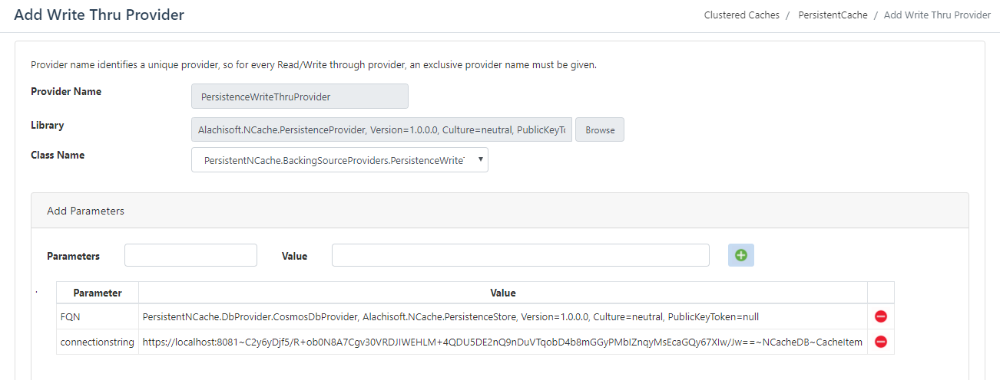

# **NCache as Persistent Cache**

### Table of contents

* [Introduction](#introduction)
* [Prerequisites](#Pre-Requisites)
* [Sample-Providers](#Sample-Providers)
* [Configurations](#Configurations)
* [Building-the-Providers](#Building-the-Providers)
* [Copyrights](#Copyrights)

# Introduction
You can configure the cache to permanently store data. By default, the cache is non-persistent - that is, the cache will be deleted once the cache is stopped. This means that if your cache stops, all existing cache items will be lost and user effort is required to populate the cache again. What if our cache is itself so intelligent that on every startup it automatically fetches all the data from data source?

Suppose you have a process that is scheduled to run every 24 hours and you are using lookup transformation to look up on a reference table that is not supposed to change for six months. When you use a non-persistent cache, the same data will be loaded in cache everyday; this will put a burden on computational cost. Hoyouver, if you create a persistent cache, the integration service will make the cache permanent. This results in a significant overhead reduction for creating and deleting cache each day.

NCache allows you to make your cache intelligent to deal with these problems along with its distributed nature. By using NCache server side features such as Read-Through Provider, Write Through Provider and Cache Startup Loader, you can make a persistent cache with NCache. In this article, I will show you how you can use these features to make our cache persistent.


The diagram represents the overall structure of this solution. `IPersistenceProvider` is the interface which is used by all NCache providers that are deployed with NCache, like *PersistenceReadThruProvider* *PersistenceWriteThruProvider* and *PersistenceStartupLoader*.

These provider implementations use a common interface to communicate with the database, so if you need to change the underlying database, there will be no need to change the providers deployed to the cache. You only need to provide a new implementation of IPersistenceProvider and pass the class name with complete assembly information against FQN in parameters to the deployed providers.

# Pre-Requisites

## Database Configurations

We need to create a database and set some configurations for the database. With this solution, you have provided two different databases, with very simple configurations as explained below:

### SQL Server

Scripts for creating database with all the required fields is provided with this solution. Using queries, you need to first create the database with name "NCacheDb" and then create a table with name "CacheItem".

1. `CacheItem` table must have `Key` column that is a primary key for table and also a Cache key along with which the cacheItem is stored in to cache.
2.  After CacheItem key you need to store the user object into the table using Json Serialization. User object can be a huge value that is why you need `varchar(max)` to store that user object into the database.
3.  `ExpirationType` is an `Enum` in order to store that enum you can use `int` in database.
4. `Itemtype` is a type of Cache Item, again an `enum` and you need an `int` to store that value into the database.
5. `TimeToLive` is a `Timespan` to specify for how long an item is needed in the cache.
6. `EvictionHint` is an `Enum` which defined the type of Eviction policy and stored in database as an int.
7. `Group` is a `string` that makes NCache search easier and stored in database as `varchar(45)` the size can be varied.
8. `ItemPriority` is an `Enum` and can be stored in to the database as an `int` or `tinyint`.
9. `InsertionTime` is a `DateTime` when item is added in to the cache.

All these parameters are passed to our provider and provider will persist these attribute to persistent store along with the cache item, so next time when the item is fetched from database then these attributes will automatically be added and configured with cache.Other attributes can also be added in a similar way.[Sql Scripts](resources/create_db.sql) for creating database.

```sql
/*    ==Scripting Parameters==
    Source Server Version : SQL Server 2017 (14.0.1000)
    Source Database Engine Edition : Microsoft SQL Server Enterprise Edition
    Source Database Engine Type : Standalone SQL Server
    Target Server Version : SQL Server 2017
    Target Database Engine Edition : Microsoft SQL Server Enterprise Edition
    Target Database Engine Type : Standalone SQL Server
*/

CREATEDATABASE [NCacheDb]
USE [NCacheDb]
GO
CREATETABLE [dbo].[CacheItem](
        [Key] [varchar](450)NOTNULL,
        [UserObject] [varchar](max)NULL,
        [ExpirationType] [int] NOTNULL,
        [ItemType] [int] NOTNULL,
        [TimeToLive] [time](7)NOTNULL,
        [EvictionHint] [int] NOTNULL,
        [Group] [nvarchar](45)NULL,
        [ItemPriority] [tinyint] NOTNULL,
        [InsertionTime] [datetime2](7)NOTNULL,
CONSTRAINT [PK_StoreItem] PRIMARYKEYCLUSTERED
([Key] ASC)WITH (PAD_INDEX=OFF,STATISTICS_NORECOMPUTE=OFF, IGNORE_DUP_KEY=OFF, ALLOW_ROW_LOCKS=ON,ALLOW_PAGE_LOCKS=ON) ON [PRIMARY]) 
ON [PRIMARY] TEXTIMAGE_ON [PRIMARY]
GO
ALTER TABLE [dbo].[CacheItem] ADD  DEFAULT ((0))FOR [ExpirationType]
GO
ALTER TABLE [dbo].[CacheItem] ADD  DEFAULT ((0))FOR [ItemType]
GO
ALTER TABLE [dbo].[CacheItem] ADD  DEFAULT ((0))FOR [OperationType]
GO
ALTER TABLE [dbo].[CacheItem] ADD  DEFAULT ((0))FOR [EvictionPercentage]
GO
ALTER TABLE [dbo].[CacheItem] ADD  DEFAULT ('00:00:00')FOR [TimeToLive]
GO
ALTER TABLE [dbo].[CacheItem] ADD  DEFAULT ((0))FOR [EvictionHint]
GO
ALTER TABLE [dbo].[CacheItem] ADD  DEFAULT (CONVERT([tinyint],(0)))FOR [ItemPriority]
GO
ALTER TABLE [dbo].[CacheItem] ADD  DEFAULT ('0001-01-01T00:00:00.0000000')FOR [InsertionTime]
GO
```
### Cosmos DB

For Cosmos DB, you do not have to create tables as Cosmos DB is a NoSQL database. All you have to do is make a collection with name "NCacheDb". On adding item to the collection you need to set `disableAutomaticIdGeneration` to true. For example,

```csharp
client.CreateDocumentAsync(UriFactory.CreateDocumentCollectionUri
        (DatabaseId,CollectionId), item, option, disableAutomaticIdGeneration:true);
```

As you have defined `Key` as an id for this collection by disabling automatic Id generation, our cache key will be used as a primary key in Cosmos DB collection.

```csharp
[JsonProperty("id")]
public string Key { get; set; }
```

`PartitionKey` also needs to be defined in `RequestOptions` of Cosmos client. For this you used our StoreItem key as an partition key.

```csharp
var option = new RequestOptions 
            { PartitionKey = new PartitionKey((item as StoreItem).Key) };
```

# Sample-Providers

## IPersistenceProvider 
In our sample you are using `IPersistenceProvider` and implemented two implementations for that provider that is Cosmos DB Provider and SqlServer DB Provider. If you are using some other database you can implement this provider and use it with Backing Source and CacheStartup loader. You just have to implement this interface and provide your implementation FQN at params configured with providers. 

```csharp
/// <summary>
/// Initialization and connection related tasks done here
/// </summary>
/// <param name="connectionString">Connection string to connect with database</param>
void Init(string connectionString);

/// <summary>
/// Add into database
/// </summary>
/// <param name="table">The key value pair to add into cache</param>
void Add(IDictionary<string, ProviderItemBase> table);

/// <summary>
/// Insert into database
/// </summary>
/// <param name="table">The key value pair to insert into cache</param>
void Insert(IDictionary<string, ProviderItemBase> table);

/// <summary>
/// Get an item from persistent cache store
/// </summary>
/// <param name="keys">The collection of keys to get from cache</param>
/// <returns></returns>
IDictionary<string, ProviderItemBase> Get(ICollection<string> keys);

/// <summary>
/// Get items from persistent cache store
/// </summary>
/// <param name="hint">Load data on the basis of hint from multiple nodes</param>
/// <returns></returns>
IDictionary<string, ProviderItemBase> GetAll(string hint = null);

/// <summary>
/// Remove from database on removing from cache
/// </summary>
/// <param name="keys">The collection of keys to be removed from persistent cache store</param>
IDictionary<string, ProviderItemBase> Remove(ICollection<string> keys);  
```

## ProviderBase

All providers - PersistenceReadThruProvider, PersistenceWriteThruProvider and PersistenceStarupLoader - have common `Init` and `Dispose` methods, so we have implemented a base class (*ProviderBase*) to provide common implementation for these methods. Moreover, these methods are virtual in the base class and any provider can override implementation for `Init` and `Dispose` like in PersistenceStartupLoader, for dealing with distribution hints.

```csharp
public abstract class ProviderBase
{
    private string _connectionString;
    protected IPersistenceProvider _persistenceProvider = null;
    protected IProviderLogger _logger = new EventVieyourLogging();

    /// <summary>
    /// Create instance for IPersistenceProvider implementation
    /// </summary>
    /// <param name="fqn">Fully qualified name for class</param>
    /// <param name="cacheName">Name of the Cache</param>
    /// <returns></returns>
    private IPersistenceProvider CreatePersistenceProviderInstance(string fqn, string cacheName)
    {
        return Util.CreateInstanceWithReflection(fqn, cacheName);
    }
    
    /// <summary>
    /// Initilization of database
    /// </summary>
    /// <param name="parameters"></param>
    /// <param name="cacheId"></param>
    public virtual void Init(IDictionary parameters, string cacheId)
    {
        if (parameters.Contains("connectionstring"))
        {
            _connectionString = (string)parameters["connectionstring"];
        }
        //Connection string for cosmos db must contain a pattern,
        // ~ separated serviceEndPoint~authKey~databaseName                
        if (parameters.Contains("FQN"))
        {
            _persistenceProvider = Util.CreateInstanceWithReflection((string)parameters["FQN"],cacheId);
        }
        _persistenceProvider.Init(_connectionString);
    }

    /// <summary>
    ///  Dispose provider
    /// </summary>
    public virtual void Dispose()
    {
        _persistenceProvider.Dispose();
    }
}
```
## PersistenceReadThruProvider

The purpose of this provider is to read data from the persistent store when the cache does not contain the item. In case a specified item does not exist in cache, and the Get call to cache is made with ReadThru specified, the deployed `PersistenceReadThruProvider` fetches the data from the persistent store.

```csharp
public class PersistenceReadThruProvider : ProviderBase, IReadThruProvider
{    
    public ProviderCacheItem LoadFromSource(string key)
    {
        return (ProviderCacheItem) (_persistenceProvider.Get(new string[] { key })[key]);
    }
    public ProviderDataTypeItem<IEnumerable> 
            LoadDataTypeFromSource(string key, DistributedDataType dataType) { ... }

    public IDictionary<string, ProviderCacheItem>
            LoadFromSource(ICollection<string> keys) { ... }
}
```
In the given code, `LoadFromSource()` method as shown above will get data from persistent store using PersistenceReadThruProvider. For full implementation of the interface, see PersistenceReadThruProvider [here](src/Alachisoft.NCache.PersistenceProvider/BackingSourceProviders/PersistenceReadThruProvider.cs).

## PersistenceWriteThruProvider

When an item is added into cache, the cache calls WriteThru provider and writes that item into persistent store. Hence, once the cache item is evicted or cache is restarted, the item is not lost and can be fetched using Read-through.

```csharp
public class PersistenceWriteThruProvider : ProviderBase, IWriteThruProvider
{
    /// <summary>
    /// Write to data source
    /// </summary>
    /// <param name="operation">Contians the operation to be written</param>
    /// <returns></returns>
    public OperationResult WriteToDataSource(WriteOperation operation)
    {
        OperationResult operationResults = new OperationResult(operation, OperationResult.Status.Success);
        switch (operation.OperationType)
        {
            case WriteOperationType.Add:
                var items = new Dictionary<string, ProviderItemBase>();
                items.Add(operation.Key, operation.ProviderItem);
                _persistenceProvider.Add(items);
                break;
            // Update and remove cases are similar and need to be handled 
        }

        return operationResults;
    }
    public ICollection<OperationResult> WriteToDataSource
            (ICollection<WriteOperation> operations){ ... }

    public ICollection<OperationResult> WriteToDataSource
            (ICollection<DataTypeWriteOperation> dataTypeWriteOperations){ ... }
}
```
The `WriteToDataSource` method writes the operation in to persistent store using PersistenceWriteThruProvider. For full implementation of the provider, see *PersistenceWriteThruProvider* interface [here](src/Alachisoft.NCache.PersistenceProvider/BackingSourceProviders/PersistenceWriteThruProvider.cs).

## PersistenceStartupLoader
PersistenceStartupLoader is called when cache is started and using the loader all the item persisted to persistent store will again be added to cache on cache startup and make no loss of data after cache restart.

```csharp
public class PersistenceStartupLoader : ProviderBase, ICacheLoader
{
    /// <summary>
    /// LoadNext is to be called until HasMoreData is false
    /// </summary>
    /// <param name="userContext">User object to be fetched in next LoadNext call</param>
    /// <returns></returns>
    public LoaderResult LoadNext(object userContext)
    {
        if(persistentItems == null)
            persistentItems = _persistenceProvider.GetAll();

        LoaderResult result = new LoaderResult();
        result.UserContext = userContext;
        result.HasMoreData = false;

        foreach (var item in persistentItems)
        {
            result.Data.Add(new KeyValuePair<string, ProviderItemBase>(item.Key, item.Value));
            currentIndex++;

            if (currentIndex % singleIterationSize == 0) 
            break;
        }  
        return result;
    }
}
```
PersistenceStartupLoader LoadNext method will be called at the time of cache startup to load data, which use PersistenceProvider to load data from persistence store. For full implementation of the interface, see  `PersistenceStartupLoader` [here](src/Alachisoft.NCache.PersistenceProvider/BackingSourceProviders/PersistenceStartupLoader.cs).

# Configurations

PersistenceReadThruProvider, PersistenceWriteThruProvider and PersistenceStartupLoader are our provider implementations with NCache. We need to add 2 parameters to each provider, that are as following:

1. `FQN` that is the Fully Qualified Name to our implementation of `IPersistenceProvider`, that is configurable in case you want to change our database layer to any other implementation. For this, you just have to change the FQN in the provider's parameters that will automatically load the new provider using reflection on cache startup. This enables you to change the database layer without having to configure a new provider deployed with the cache.

2. `ConnectionString` is to be provided as providers params, you can change our database by changing the connection string provided by the params without any code change or assembly deployments.



Please refer to the following links to learn how to configure the providers in NCache:
- [ReadThruProvider](http://www.alachisoft.com/resources/docs/ncache/admin-guide/read-through-provider.html) 
- [WriteThruProvider](http://www.alachisoft.com/resources/docs/ncache/admin-guide/write-through-provider.html)
- [CacheStartupLoader](http://www.alachisoft.com/resources/docs/ncache/admin-guide/configure-cache-startup-loader.html) 

# Building-the-Providers

##  Build
Building providers is quite easy, providers are written in .NET Standard 2.0 and can be used with .Net Core Server or .NET Framework Server. We need to provide all the assemblies deployed with the cache. This solution has two projects:

1. *Alachisoft.NCache.PersistenceProvider* project contains the implementation of IReadThru provider, IWriteThru provider and ICacheLoader. After building this project, you can deploy all the providers with cache as explained in [NCache Administrator's Guide](https://www.alachisoft.com/resources/docs/ncache/admin-guide/deploy-providers.html). Once these providers are deployed, you can easily change the database layer by just changing the configuration.

2. *Alachisoft.NCache.PersistenceStore* project contains the actual db layer for the providers, IPersistenceProvider implementation is given in this project FQN for the implementation is required to be configured with providers in the provider project.

## Run 
For using Read-thrugh/Write-through in your application, you need to use NCache API with [WriteThruOptions](http://www.alachisoft.com/resources/docs/ncache/dotnet-api-ref/Alachisoft.NCache.Runtime.Caching.WriteThruOptions.html) and [ReadThruOptions](http://www.alachisoft.com/resources/docs/ncache/prog-guide/using-read-through.html).

### WriteThru sample
```csharp
cache.Add(key, cacheItem, new WriteThruOptions(WriteMode.WriteThru));
```
### ReadThru sample
```csharp
cache.Get(key, new ReadThruOptions(ReadMode.ReadThru));
```

On cache start, cache startup loader will be invoked and load all the items automatically residing on database or any other persistent store and add them to the cache using Write-Through. If you only want to add the items that are persisted on the persistent store instead of all the items, then use the Read-Through Provider. This way, the cache will automatically fetch the data from the persistence store. 

Both of these implementations have their own advantages and disadvantages. For larger data sets, cache startup loader results in costly overhead while read-through will save you the cost. On the other hand, Read-Through results in an additional network trip since the data is fetched from the backing source which is a slow process. Hoyouver, cache startup loader will automatically load the data on cache startup.
This means that both methods are effective, based on your business need.

# Copyrights

[C] Copyright 2019 Alachisoft 