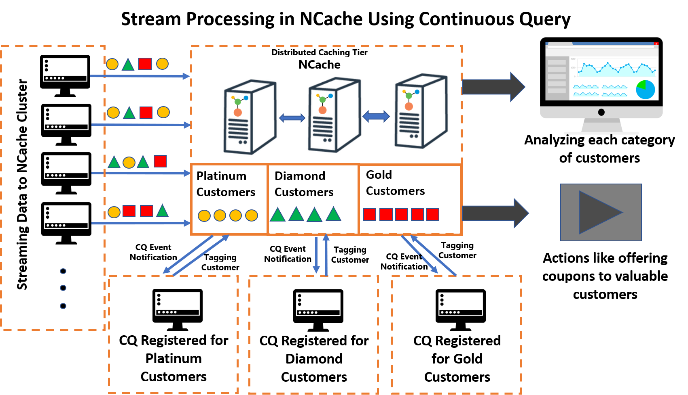

# Stream Processing Using NCache Continuous Query

### Table of contents

* [Introduction](#introduction)
* [Getting Started](#getting-started)
* [Working](#working)
* [Built With](#built-with)
* [Additional Resources](#additional-resources)

## Introduction
This project demonstrates how stream can be processed in NCache server nodes using continuous query which not only provides super fast results but also allows you to monitor and do actions on that data.

## Getting Started

These instructions will get you a copy of the project up and running on your local machine for development and testing purposes.

### Prerequisites

Following are required before you can run this app:

 - NCache Enterprise (version 5.0 SP2)
 - DotNET Core Runtime (version 3.0)
 - DotNET Core SDK (version 3.0)
 - Visual Studio (VS2019)

Note that the app has been tested with the mentioned versions.

### Installing
*Please ensure that the prerequisites are installed before continuing.*

#### Create Cache

A cache needs to be linked with the app. 
On installing NCache, two caches are created by the name of `mypartitionedcache` and `myreplicatedcache`.
If the default cache is not available, Create a new cache. [Docs](https://www.alachisoft.com/resources/docs/ncache/admin-guide/create-new-cache-cluster.html?tabs=windows)

#### Link Cache with App

Mention this cache name in "CacheName" attribute of following files: 
1. \StreamProcessing\StreamToNCache\appsettings.json 
1. \StreamProcessing\StreamProcessingUI\appsettings.json
   {
	   "CacheName":  "mypartitionedcache"
   }

### Starting the App

This solution contains three projects:
1.	Models
2.	StreamProcessingUI
3.	StreamToNCache
Build the project in windows environment and run StreamProcessingUI and StreamToNCache using Visual Studio. Upon running, two separate console windows will be opened.

## Working

Following is an explanation to the working of different parts of stream processing solution.
1.	Stream Processing UI will register continuous query for each category of customer and print all the results of each category and decide what to offer to each category by retaining those customers data in cache.
2.	StreamToNCache will push customers data into cache.
Customers data that is being streamed in NCache has expiration if 15 secs and it consist of 4 categories.
•	Customer with orders less than 4 which are less valuable customers (no need to retain those customers data in Cache).
•	Customer with orders greater than 4 and less than 7 which are valuable customers and tagged with “Bronze Customers” (Data retained by removing expiration).
•	Customer with orders greater than 6 and less than 10 which are more valuable customers and tagged with “Silver Customers” (Data retained by removing expiration).
•	Customer with orders greater than 9 which are most valuable customers and tagged with “Gold Customers” (Data retained by removing expiration).
As the customers data is being tagged according to their importance we can easily do the analysis and change strategy by providing coupons to and discounts to increase business.

### Architecture
All parts of the app are connected to an NCache feature. Following is a detail on each feature's implementation and use:

### Technology Used

* [NCache](http://www.alachisoft.com/ncache/) - Distributed Cache for .NET

### Development Tools

* [Visual Studio 2019](https://visualstudio.microsoft.com/)- For creation of project and code

## Additional Resources

#### Documentation
The complete online documentation for NCache is available at:
http://www.alachisoft.com/resources/docs/#ncache

#### Programmers' Guide
The complete programmers guide of NCache is available at:
http://www.alachisoft.com/resources/docs/ncache/prog-guide/

## Technical Support

Alachisoft [C] provides various sources of technical support. 

- Please refer to http://www.alachisoft.com/support.html to select a support resource you find suitable for your issue.
- To request additional features in the future, or if you notice any discrepancy regarding this document, please drop an email to [support@alachisoft.com](mailto:support@alachisoft.com).

## Copyrights

[C] Copyright 2019 Alachisoft