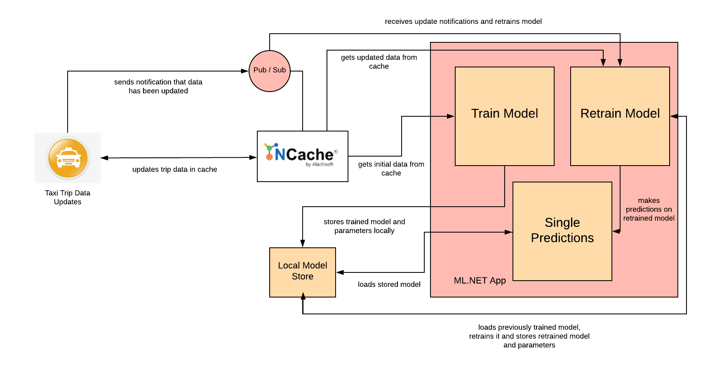

# Taxi Fare Prediction using ML.NET with NCache

## Table of contents

* [Introduction](#introduction)
* [Prerequisites](#prerequisites)
* [Running the Application](#running-the-application)
* [Working](#working)
* [Built With](#built-with)
* [Additional Resources](#additional-resources)

## Introduction

This project highlights how NCache can be used with ML.NET for predicting taxi fares. In real time machine learning scenarios, data is flowing very rapidly and machine learning model is being retrained continuously on the basis of this new data so that accuracy can be maintained. The number of inserts per second is very high in such scenarios. Also, this data is being read on ML side. This can cause slowdowns. To avoid such issues NCache has been used. NCache is a highly scalable distributed cache in .NET. Using NCache for data processing increases the performance of our system as it provides fast read/write operations. NCache being scalable can handle efficiently if the data sets are very large. ML.NET reads data from a file, a data source or Enumerable. NCache provides distributed data structures thus making it very easy for direct retrieval and reading of data by ML.NET. No extra data manipulation is required. User can easily store data in the form of lists and directly load it in his ML.NET model. NCache’s pub/sub functionality can be efficiently used here for notifications without any performance issues. 

## Prerequisites

Following are required before you can run this app:

 - NCache Enterprise (version 5.0)
 - DotNET Core Runtime (version 3.0)
 - DotNET Core SDK (version 3.0)
 - Visual Studio (VS2019)

Note that the app has been tested with the mentioned versions.

## Running the Application

### Create Cache

A cache needs to be linked with the app. 
On installing NCache, two caches are created by the name of `mypartitionedcache` and `myreplicatedcache`.
If the default cache is not available, Create a new cache.

#### Link Cache with App

Mention this cache name in "CacheId" attribute of following files:

1. `\TaxiFarePrediction\TaxiFarePredictionConsoleApp\App.config 
2. `\AddTripDataInCache\AddTripDataInCache\App.config

### Starting the App

This solution contains three projects:
1. TaxiFarePrediction
2. AddTripDataInCache
3. DataStructures

Build the project in windows environment and run TaxiFarePrediction app first. Then use the AddTripDataInCache for adding real time continuous data in cache that will be used for retraining of model.

TaxiFarePredictionConsoleApp adds initial training data into cache and uses this further for initially training the ML.NET model.

AddTripDataInCache reads a data chunk from .csv data file. It then takes data from cache on which previous model training has been done. It uses the sliding window concept for combining previous data with new data and updates the dataset in cache. It also publishes a message to the specified topic so that ML.NET application receives a notification that model needs to be retrained.

## Working

Following is an explanation to the working of different parts of this taxi fare prediction model.

### User Roles

The app has two main users

 1. User responsible for training and retraining of model.
 2. User that provides new taxi trip data.

#### Training and Retraining of model

The user trains the model on basis of initial data. Whenever new data is added then this user is notified via pub/sub and model retraining takes place.

#### User that provides new taxi trip data

This user updates taxi trip data through a public API.

### App flow

Here are how the app functions:

#### For user training/retraining model and making predictions

 1. The user runs the console app which connects to NCache and loads data.
 2. The user trains the machine learning model on the basis of this initial data.
 3. The user subscribes to a topic using pub/sub for receiving updates on whenever new data is added.
 4. On basis of this new data, the model is retrained and new predictions are made.
 
#### For user providing new taxi trip data

 1. The user adds new taxi trip data into cache.
 2. A message is published that new data has been added in cache.
 
### Architecture

All parts of the app are connected to an NCache feature. Following is a detail on each feature's implementation and use:


#### Pub/Sub

Handling Pub/Sub in NCache can be done in the following way:

##### Creating Topic
```
// create pub/sub topic on match start
_cache.MessagingService.CreateTopic(DataStructures.Constants.TopicName);
```

##### Fetch Topic
```
// fetch topic handler from cache
ITopic topic = _cache.MessagingService.GetTopic(DataStructures.Constants.TopicName);
```

##### Publish to Topic
```
// publish Message on topic
topic.Publish(message, DeliveryOption.All);
```

##### Subscribe to Topic
```
// subscribe this server to ongoing match topic
_cache.MessagingService.GetTopic(DataStructures.Constants.TopicName).CreateSubscription(_selfSubscribe);
```

#### App Data Cache

Previous data is retrieved from cache. When new data is received then initial chunk of cached data is discarded and this new data is appended with the leftover chunk of previous data and updated in cache. Distributed lists are used for achieving this. 

#### Build ML.NET model

A model has to be trained for using it to make predictions. This model is saved in the form of a .zip file and used when predictions are being made.

##### 1. Build Model pipeline

Building model pipeline evolves around two steps. First, loading dataset from cache. And second, transforming the data according to ML algorithm. 
 
##### 2. Store pipeline and trained model

Model is trained on basis of specified ML algorithm and saved in the form of a .zip file for later use. The pipeline is also saved as a .zip file.

##### 3. Retrain model on update notification

The model and pipeline are loaded from the .zip files and retrained according to the ML.NET retraining algorithm. The retrained model and pipeline are then again saved for future use.

##### 4. Making predictions

After every training/retraining of model, single value predictions are made on transformed data for testing model accuracy.

## Built With

### Technology Used

* [NCache](http://www.alachisoft.com/ncache/) - Distributed Cache for .NET
* [ML.NET](https://docs.microsoft.com/en-us/dotnet/machine-learning/) - Machine Learning for .NET

### Development Tools

* [Visual Studio 2019](https://visualstudio.microsoft.com/)- For creation of project and code

## Additional Resources

https://github.com/dotnet/machinelearning-samples/tree/master/samples/csharp/getting-started/Regression_TaxiFarePrediction

#### Documentation

The complete online documentation for NCache is available at:
http://www.alachisoft.com/resources/docs/#ncache

#### Programmers' Guide

The complete programmers guide of NCache is available at:
http://www.alachisoft.com/resources/docs/ncache/prog-guide/

## Technical Support

Alachisoft [C] provides various sources of technical support. 

- Please refer to http://www.alachisoft.com/support.html to select a support resource you find suitable for your issue.
- To request additional features in the future, or if you notice any discrepancy regarding this document, please drop an email to [support@alachisoft.com](mailto:support@alachisoft.com).

## Copyrights

[C] Copyright 2020 Alachisoft
