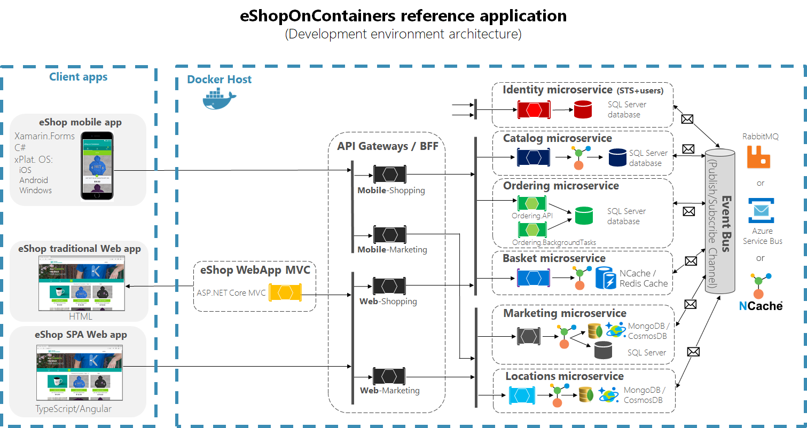

#  eShopOnContainers with NCache 

## Table of contents

* [Introduction](#introduction)
* [Prerequisites](#prerequisites)
* [NCache Features Highlighted in Application](#ncache-features-highlighted-in-application)
* [Running the Application](#running-the-application)
* [Additional Resources](#additional-resources)
* [Technical Support](#technical-support)
* [Copyrights](#copyrights)

## Introduction

[eShopOnContainers](https://github.com/dotnet-architecture/eShopOnContainers) is a well-known GitHub repository licensed by MIT, that demonstrates various design patterns and answers to common issues when developing microservices-based applications. This includes code on using messaging brokers to allow asynchronous communication between microservices, health check monitoring and Command Query Responsibility Segregation (CQRS). 

We have extended *eShopOnContainers* in this current repository (*eShopOnContainers-dev*) to demonstrate [NCache](https://www.alachisoft.com/ncache/) as an ideal candidate for use in microservices-based applications as a feature rich distributed cache. Some of the main areas where NCache can be used successfully in this scenario are as follows:

- Messaging broker for asynchronous communication between microservices.
- Implement cache-aside pattern for better read performance using object caching and EF Core caching. 
- Serve as a key storage provider for ASP.NET Core data protection services.

The following figure shows how the eShopOnContainers architecture has been enhanced by including NCache as a distributed caching layer and pub/sub messaging platform with its features:



As seen in the figure above, NCache can be used for pub/sub messaging as well as for caching data to boost read operations. Care has been taken to integrate NCache features into the code without compromising the integrity of the original application. Therefore, the eShopOnContainer application can be used in its original form while allowing for NCache features to be demonstrated as well. 

As such, all the parameters needed to see NCache in action can be populated in the **appsettings.json** files as well as in the docker compose file environment section.

## Pre-requisites

Besides the original pre-requisites of the eShopOnContainers application, following are the additional requirements when using NCache:

- **NCache 5.0 Enterprise edition** is installed on the cache servers with **Server Activated** licensing. This is important for running containerized applications accessing external NCache server processes. 
- Make sure to update the NCache server information in the **client.ncconf** files included in each solution project. You also have the option of [creating caches](https://www.alachisoft.com/resources/docs/ncache/admin-guide/create-new-cache-cluster.html) with the IDs already given in the client.ncconf files and just update the IP addresses in the docker compose **environment** sections or the **appsettings.json** files to match the node IP addresses of the corresponding caches.
- The cache to be used for Pub/Sub messaging between the microservices is common to all the microservices and, as such, should have **identical values for the cluster node IP addresses and cache ID** for each microservice
- Before running the application, make sure all the required caches are running.

## NCache Features Highlighted in Application

- **Messaging Broker**

NCache can easily be configured for use as a messaging broker for asynchronous communications between microservices using the Publisher/Subscriber model. Pub/Sub is enabled in NCache by defining a topic on which the microservices can publish events as well as subscribe to it. 

To implement the  NCache event bus for asynchronous communications in eShopOnContainers, the implementation has been done in the same way as was done for the RabbitMQ and NServiceBus messaging brokers.

Therefore, following is a code snippet of the implementation of a persistant connection mechanism to allow for connection to NCache Pub/Sub servers, the details of which can be found [here](./src/BuildingBlocks/EventBus/EventBusNCache):

```csharp
public class DefaultNCachePersistentConnection : INCachePersistantConnection
{
	// Initialization code
	private ICache CreateCache(string cacheID, bool enableClientLogs)
	{
		if (_cache == null)
		{
			List<ServerInfo> servers = new List<ServerInfo>();
			foreach(var ipAddress in _ipAddresses)
			{
				servers.Add(new ServerInfo(ipAddress));
			}
			return CacheManager.GetCache(
				cacheID, 
				new CacheConnectionOptions
				{
					ServerList = servers,
					// Other parameters
				});
		}			
		return _cache;	
	}
	public ITopic CreateModel()
	{
		if (_topic == null)
		{
			_cache = CreateCache(_cacheID, _enableClientLogs);
			_topic = _cache.MessagingService.GetTopic(_topicID);
			if (_topic == null || _topic.IsClosed)
			{
				_topic = _cache.MessagingService.CreateTopic(_topicID);
				_topic.MessageDeliveryFailure += _topic_MessageDeliveryFailure;
			}
		}
		return _topic;
	}
	// Rest of code
}
```

The most important feature of this implementation is that we are only exposing the `ITopic` instance that represents the topic created in the cache identified by the `_cacheID` field. 

NCache has a built-in retry mechanism together with the *keep-alive* feature to make sure multiple attempts are made to connect to cache in case of temporary network glitches. This removes the need to employ a 3rd party library like [Polly](https://github.com/App-vNext/Polly) to implement and execute retry policies. 
    
Once the persistent connection mechanism is in place, it can be used in the main NCache Pub/Sub event bus implementation as shown below:

```csharp  
public class EventBusNCache : IEventBus
{
	// Initialization code
	public void Publish(IntegrationEvent @event)
	{
		var eventName = @event.GetType().Name;
		var topic = _persistantConnection.CreateModel();
		if (topic == null)
		{
			return;
		}
		string body = JsonConvert.SerializeObject(@event);
		var payLoad = Tuple.Create(eventName, body);
		Message message = new Message(payLoad);
		topic.Publish(message, DeliveryOption.All, true);
	}
	public void Subscribe<T, TH>()
		where T : IntegrationEvent
		where TH : IIntegrationEventHandler<T>
	{
		var eventName = _subsManager.GetEventKey<T>();
		DoInternalSubscription(eventName);
		_subsManager.AddSubscription<T, TH>();
	}
	public void SubscribeDynamic<TH>(string eventName) where TH : IDynamicIntegrationEventHandler
	{
		DoInternalSubscription(eventName);
		_subsManager.AddDynamicSubscription<TH>(eventName);
	}
	public void Unsubscribe<T, TH>()
		where T : IntegrationEvent
		where TH : IIntegrationEventHandler<T>
	{
		var eventName = _subsManager.GetEventKey<T>();
		_subsManager.RemoveSubscription<T, TH>();
	}
	public void UnsubscribeDynamic<TH>(string eventName) where TH : IDynamicIntegrationEventHandler
	{
		_subsManager.RemoveDynamicSubscription<TH>(eventName);
	}
	public void Dispose()
	{
		if (_persistantConnection != null)
		{
			_persistantConnection.Dispose();
		}
		_subsManager.Clear();
	}
	private void DoInternalSubscription(string eventName)
	{
		var containsKey = _subsManager.HasSubscriptionsForEvent(eventName);

		if (!containsKey)
		{
			if (_subscription == null)
			{
				var topic = _persistantConnection.CreateModel();

				if (topic == null)
				{
					return;
				}
				_subscription = topic.CreateDurableSubscription(_subscriptionName,SubscriptionPolicy.Shared,
					(o, args) =>
					{
						var payLoad = args.Message.Payload as Tuple<string, string>;
						var eventName1 = payLoad.Item1;
						var message = payLoad.Item2;
						ProcessEvent(eventName1, message).Wait();
					});
			}
		}
	}
	private async Task ProcessEvent(string eventName, string message)
	{
		if (_subsManager.HasSubscriptionsForEvent(eventName))
		{
			using (var scope = _autofac.BeginLifetimeScope(AUTOFAC_SCOPE_NAME))
			{
				var subscriptions = _subsManager.GetHandlersForEvent(eventName);
				foreach (var subscription in subscriptions)
				{
					if (subscription.IsDynamic)
					{
						var handler = scope.ResolveOptional(subscription.HandlerType) as IDynamicIntegrationEventHandler;
						if (handler == null) continue;
						dynamic eventData = JObject.Parse(message);
						await handler.Handle(eventData);
					}
					else
					{
						var handler = scope.ResolveOptional(subscription.HandlerType);
						if (handler == null) continue;
						var eventType = _subsManager.GetEventTypeByName(eventName);
						var integrationEvent = JsonConvert.DeserializeObject(message, eventType);
						var concreteType = typeof(IIntegrationEventHandler<>).MakeGenericType(eventType);
						await (Task)concreteType.GetMethod("Handle").Invoke(handler, new object[] { integrationEvent });
					}
				}
			}
		}
		else
		{
			// Other code
		}
	}
}
```

More information about NCache Pub/Sub feature can be found [in NCache Documentation](http://www.alachisoft.com/resources/docs/ncache/prog-guide/publish-subscribe-ncache.html).

- **Cache-Aside Pattern**

Being a distributed caching provider, NCache is an ideal candidate for caching solutions for microservices applications where scalability, availability and performance are of utmost importance. 

In this regard, besides using the native NCache APIs for caching data, NCache also provides the EF Core caching provider implementation to allow for seamless integration of caching into the application during EF Core CRUD operations. To demonstrate how easy it is to use EF Core caching, consider the following code snippet taken from the [Catalog.API microservice](.\src\Services\Catalog\Catalog.API\Controllers\CatalogController.cs) in the solution to fetch a collection of items from the database and cache it in the NCache servers:

```csharp  
if (!_settings.EFCoreCachingEnabled)
{
	return await _catalogContext.CatalogTypes.ToListAsync();
}
else
{
	var options = new CachingOptions
	{
		StoreAs = StoreAs.SeperateEntities
	};
	options.SetAbsoluteExpiration(DateTime.Now.AddMinutes(_settings.NCacheAbsoluteExpirationTime));
	var result = await _catalogContext.CatalogTypes.FromCacheAsync(options);
	return result.ToList();
}			
```

As can be seen, the EF Core caching provider provides extension methods such as `FromCache()` that allow for data not present in the cache to be fetched and then stored in the cache so that next time the query is run with the `FromCache()` extension method, the cache will furnish the required data. Furthermore, to mitigate stale data, expiration can be set on the cached items using the **CachingOptions** instance as shown above.
	
For more information about NCache EF Core caching,[read the docs here](http://www.alachisoft.com/resources/docs/ncache/prog-guide/entity-framework-core-caching.html).

	
- **Data Protection Key Provider**

NCache can also be used successfully as an external key storage provider when using [Data Protection services](https://docs.microsoft.com/en-us/aspnet/core/security/data-protection/introduction?view=aspnetcore-2.2) provided by ASP.NET Core. Following is an implementation of the `IXmlRepository` using NCache:

```csharp
public sealed class NCacheXmlRepository : IXmlRepository
{
	private readonly string _cacheID;
	private readonly CacheConnectionOptions _options;

	public NCacheXmlRepository(string cacheID, CacheConnectionOptions options = null)
	{
		_cacheID = cacheID;
		_options = options;
	}
	public IReadOnlyCollection<XElement> GetAllElements()
	{
		try
		{
			using (var _cache = CacheManager.GetCache(_cacheID, _options))
			{
				var items = _cache.SearchService.GetByTag<string>(new Tag("NCacheDataProtectionKeys"));
				var list = new List<XElement>();

				if (items != null)
				{
					foreach (var item in items)
					{
						list.Add(XElement.Parse(item.Value));
					}
				}
				return list;
			}
		}
		catch (Exception)
		{
			return new List<XElement>().AsReadOnly();
		}
	}
	public void StoreElement(XElement element, string friendlyName)
	{
		using (var cache = CacheManager.GetCache(_cacheID, _options))
		{
			var xml = element.ToString(SaveOptions.DisableFormatting);

			var Id = Guid.NewGuid().ToString();
			if (friendlyName != null)
			{
				Id = friendlyName;
			}
			var cacheItem = new CacheItem(xml)
			{
				Tags = new[] { new Tag("NCacheDataProtectionKeys") }
			};
			cache.Insert(Id, cacheItem);
		}
	}
}
```

Using this, we can create an extension method on the `IDataProtectionBuilder` interface to register NCache as a data protection key provider like so:

```csharp
public static class NCacheDataProtectionBuilderExtensions
{
	public static IDataProtectionBuilder PersistKeysToNCache( this IDataProtectionBuilder builder,
	string cacheID, CacheConnectionOptions cachingOptions = null)
	{
		if (builder == null){ throw new ArgumentNullException(nameof(builder));	}
		if (cacheID == null){ throw new ArgumentNullException(nameof(cacheID));	}
		var repository = new NCacheXmlRepository(cacheID, cachingOptions);
		builder.Services.Configure<KeyManagementOptions>(options =>
		{
			options.XmlRepository = repository;
		});
		return builder;
	}
}
```
> The full working copy of this class can be found [here](.\src\BuildingBlocks\NCacheDataProtectionBuilderExtensions).

- **NCache Health Checks**

[ASP.NET Core health checks API](https://docs.microsoft.com/en-us/aspnet/core/host-and-deploy/health-checks?view=aspnetcore-2.2) is a very useful feature that is highly recommended for monitoring the health status of your ASP.NET Core applications together with any dependencies they have to function correctly. These dependencies include primary data stores such as databases and file systems as well as caches in case the cache-aside pattern is in place. Having such health checks in place really cuts down on investigating any issues when running the applications and the logging of the issues can be automated quite easily.

In this regard, the application provides a `IHealthCheck` implementation for NCache that checks on the health of any caches being used, whether they be for pub/sub messaging or object caching. In this regard, following is the NCache `IHealthCheck` [implementation](.\src\BuildingBlocks\NCacheHealthCheck):

```csharp
public class NCacheHealthCheck : IHealthCheck
{
	private readonly string _cacheID;
	private readonly CacheConnectionOptions _cacheConnectionOptions;

	public NCacheHealthCheck(string cacheID, CacheConnectionOptions cacheConnectionOptions = null)
	{
		_cacheID = cacheID ?? throw new ArgumentNullException(nameof(cacheID));
		_cacheConnectionOptions = cacheConnectionOptions;
	}	
	public Task<HealthCheckResult> CheckHealthAsync(HealthCheckContext context, CancellationToken cancellationToken = default(CancellationToken))
	{
		try
		{
			using (var cache = CacheManager.GetCache(_cacheID, _cacheConnectionOptions))
			{
				return Task.FromResult(HealthCheckResult.Healthy($"Cache {_cacheID} is running"));
			}
		}
		catch (Exception e)
		{
			return Task.FromResult(HealthCheckResult.Unhealthy($"Cache {_cacheID} connection ran into problems", e));
		}
	}
}

public static class NCacheHealthCheckBuilderExtensions
{
	const string NAME = "NCache-Health-Check";

	public static IHealthChecksBuilder AddNCacheHealthCheck(this IHealthChecksBuilder builder,
		string cacheID, string name,
		HealthStatus? failureStatus = HealthStatus.Unhealthy,
		IEnumerable<string> tags = null,
		CacheConnectionOptions cacheConnectionOptions = null)
	{
		return builder.Add(new HealthCheckRegistration(
			name ?? NAME,
			sp => new NCacheHealthCheck(cacheID, cacheConnectionOptions),
			failureStatus,
			tags));
	}
}
```

## Running the Application

Being an extension of the original eShopOnContainers application, running the application with NCache features enabled is identical to the execution of the original application, the details of which can be found [at GitHub](https://github.com/dotnet-architecture/eShopOnContainers/wiki). 

In addition to the steps given in the previous section, the following checks must be done to use NCache:

- Start [NCache Web Manager](http://www.alachisoft.com/resources/docs/ncache/admin-guide/ncache-web-manager.html) and verify all the required caches are running and that the ID and IP addresses of the nodes match those given in the **appsettings.json** files and/or docker compose environmental variables.

- Make sure all the ports needed to communicate with NCache are open.

- In the **docker-compose.override.yml** file, make the necessary changes for the NCache cache ID and IP addresses. 
	-   Make sure to set boolean values concerned with enabling/disabling NCache caching to **true**.
	-   For the cache serving as the pub/sub messaging broker, the IP addresses are given as **xxxx.xxxx.xxxx.xxxx-yyyy.yyyy.yyyy.yyyy**. Individual IP addresses are separated by a hyphen so you can add as many nodes in the NCache cluster as you want. 
	-   For the caches used for object caching, EF Core caching and those serving as Data Protection Key providers, the IP addresses are similarly given as **aaaa.aaaa.aaaa.aaaa-bbbb.bbbb.bbbb.bbbb**.

- Make sure that Docker is running in Linux mode. Information for running the application using windows containers can be found [here](https://github.com/dotnet-architecture/eShopOnContainers/wiki/Windows-setup).
- Make sure to have a working Internet connection for any Docker image pulls from external registries.
- From the command shell, go to the root directory of the solution where the docker compose files are located and run the following script to build and run the containers:

```batchfile
docker-compose -f docker-compose.yml -f docker-compose.override.yml up 
```

## Additional Resources

### Documentation
The complete online documentation for NCache is available at:
[http://www.alachisoft.com/resources/docs/](http://www.alachisoft.com/resources/docs/)

### Programmers' Guide
The complete programmers guide of NCache is available at:
[http://www.alachisoft.com/resources/docs/ncache/prog-guide/](http://www.alachisoft.com/resources/docs/ncache/prog-guide/)

## Technical Support

Alachisoft [C] provides various sources of technical support. 

- Please refer to [Alachisoft Support](http://www.alachisoft.com/support.html) to select a support resource you find suitable for your issue.
- To request additional features in the future, or if you notice any discrepancy regarding this document, please drop an email to [support@alachisoft.com](mailto:support@alachisoft.com).

### Copyrights

[C] Copyright 2019 Alachisoft 
